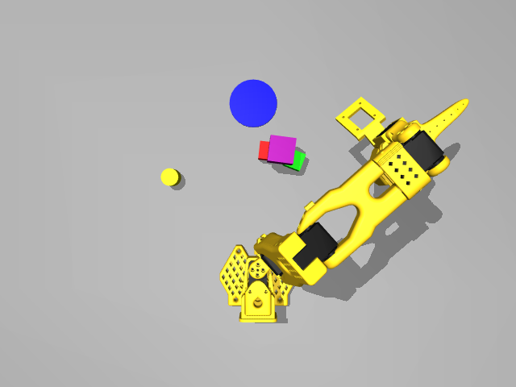

# SO101 MuJoCo 连续任务日志｜2026-09-11

记录本次对话完成的 5 项连续仿真任务，以及实际发生的失败尝试、碰撞调整和结果核验。

## 会话与数据来源

- 会话目录：`loop-20260911-143004-815664`；场景 `workbench`，world `1`，seed `4`。
- 时间统一为 Europe/Paris（当日 UTC+02:00）；原始事件时间为 UTC。表中为事件记录时刻，不是精确的电机启动时刻。
- 原始事件范围：2026-09-11 14:31:03–14:56:28；请求序号 1–127。
- 原始数据：[events.jsonl](../runs/loop-20260911-143004-815664/events.jsonl)、[session.json](../runs/loop-20260911-143004-815664/session.json)。本记录覆盖截止序号 127 的快照；服务继续运行后原始文件可能追加或更新。
- 感知来源：俯视与腕部 RGB-D、本体 TCP/关节反馈；动作由当前对话逐步决策，通过执行器和物理仿真实现。没有重置世界、瞬移或绑定物体，也未操作真实硬件。
- 物体尺寸：红、绿方块各 25 毫米；紫色方块 35 毫米；黄色圆柱直径/高度 25 毫米。
- 全部 5 项任务由服务记录为 `succeeded`，验证类型为 `codex_visual`，即模型依据画面和深度作出的判断，不等同于独立自动评测。

## 启动前处理（来自对话，未包含在服务事件日志中）

直接运行 `loop.py` 时未指定 `serve/command/status` 模式，命令行解析报缺少 `mode`。之后启动包装脚本提示缺少 `.venv-loop`；激活 Conda 环境仍未改变脚本默认解释器。解释了 `SO101_PYTHON` 覆盖方式及 `setup_loop.sh` 安装方式。运行安装脚本时，`uv` 提示 `.venv-loop` 已存在并要求确认替换。服务日志没有记录完整安装输出；首次操作前的 `status` 确认服务已运行且没有活动任务。

## 任务总览

| # | 本地时间 | 用户任务 | 动作尝试 | 最终记录 |
| --- | --- | --- | ---: | --- |
| 1 | 14:31:08–14:33:14 | 抓起绿色方块 | 7 | succeeded / codex_visual |
| 2 | 14:33:56–14:35:23 | 把绿色方块放在蓝色区域上 | 6 | succeeded / codex_visual |
| 3 | 14:36:19–14:38:44 | 将红色方块放在绿色上面 | 10 | succeeded / codex_visual |
| 4 | 14:38:58–14:43:12 | 把绿色方块放在红色方块上面 | 19 | succeeded / codex_visual |
| 5 | 14:45:17–14:56:28 | 用紫色、绿色、红色方块搭一个金字塔，下方两个方块中有空隙。空隙为一个方块边长的1/2 | 42 | succeeded / codex_visual |

共 **84 次动作尝试**：move 63 次、gripper 16 次、wait 5 次；其中 **82 次返回 ok:true，2 次 IK 拒绝**。此外有 24 次 localize、7 次 status、2 次 observe、5 次 begin、5 次 complete，共 127 条服务事件。

`ok:true` 仅表示动作接口成功执行，不能据此断言无碰撞或任务成功。金字塔过程中的推移、接触高度偏差就是需要结合反馈识别的例子。

## 任务 1：抓起绿色方块

- 任务 ID：`6adf038a42b54b2d9c73805143317aec`
- 时间：14:31:08–14:33:14；事件序号 2–17；末帧 11。

从俯视图定位绿色方块，原始可见顶面约为 `(187.49, -169.95, 24.95)` 毫米。最初两次朝下姿态的移动请求被 IK 拒绝：目标分别为 `(112, -188, 170)` 和 `(190, -170, 100)` 毫米，误差分别为 0.0410、0.0092。两次均未执行运动；随后查询状态并观察，没有盲目重发。

将接近高度降低至 65 毫米后可达，下降到约 20 毫米，闭合夹爪，再抬升到约 65 毫米。TCP 实际抬升约 45 毫米，等待 1.5 秒后方块仍在夹爪内；腕部 RGB-D 可见表面高度约 61.93 毫米，支持方块已经离桌的判断。最终保持夹持。

结果图：[俯视 RGB](../runs/loop-20260911-143004-815664/world-001/0011-overhead.png) · [腕部 RGB](../runs/loop-20260911-143004-815664/world-001/0011-wrist.png)

## 任务 2：把绿色方块放在蓝色区域上

- 任务 ID：`6d903d330a7c46f1add4a5634565ed12`
- 时间：14:33:56–14:35:23；事件序号 19–27；末帧 18。

从新画面定位蓝色圆区中心，可见表面约为 `(272.02, 6.51, 2.00)` 毫米。保持抓取移动到圆区上方，再下降至 TCP 高度约 25 毫米，张开夹爪，竖直抬离并侧退。等待 1.5 秒后，俯视图显示绿色方块位于蓝色区域内部、接近中心，未滑落。

结果图：[俯视 RGB](../runs/loop-20260911-143004-815664/world-001/0018-overhead.png) · [腕部 RGB](../runs/loop-20260911-143004-815664/world-001/0018-wrist.png)

## 任务 3：将红色方块放在绿色上面

- 任务 ID：`6646b4b2c43144b09d2f0c45a0e7090c`
- 时间：14:36:19–14:38:44；事件序号 29–43；末帧 29。

重新定位红色和绿色方块。抓取桌面上的红色方块，抬离后移动到绿色方块顶部，缓慢下降、张开夹爪、抬离并侧退。静置 2 秒后结构保持稳定。

RGB-D 测得红色顶面高度约 49.90 毫米，绿色原顶面高度约 24.95 毫米，差值约一个 25 毫米方块边长；俯视位置也相互对齐。最终为红色在上、绿色在下，位于蓝色区域。

结果图：[俯视 RGB](../runs/loop-20260911-143004-815664/world-001/0029-overhead.png) · [腕部 RGB](../runs/loop-20260911-143004-815664/world-001/0029-wrist.png)

## 任务 4：把绿色方块放在红色方块上面

- 任务 ID：`3ea87afd70264f01a936334111e6ec94`
- 时间：14:38:58–14:43:12；事件序号 45–70；末帧 49。

起始状态是红色在上、绿色在下。为交换上下顺序，先将红色从顶部取下，放到蓝色区域旁的空桌面；松爪、退开后重新定位两块，再抓取绿色并叠放到红色顶部。

最后松爪、抬离、侧退并等待 2 秒。绿色顶面 RGB-D 高度约 49.87 毫米，红色桌面顶面约 24.95 毫米；绿色顶面选点与先前红色中心选点水平相差约 1.34 毫米。结果为绿色在上、红色在下，叠放位置在蓝色区域旁，而非蓝色区域内。

结果图：[俯视 RGB](../runs/loop-20260911-143004-815664/world-001/0049-overhead.png) · [腕部 RGB](../runs/loop-20260911-143004-815664/world-001/0049-wrist.png)

## 任务 5：用紫色、绿色、红色方块搭一个金字塔，下方两个方块中有空隙。空隙为一个方块边长的1/2

- 任务 ID：`731cdfe619e944ea96df923935498eca`
- 时间：14:45:17–14:56:28；事件序号 72–127；末帧 92。

用户要求三个方块组成下二上一的金字塔，底座间留半个方块边长的空隙。最初口头计划为紫、红在下、绿在上；考虑紫色为 35 毫米、红绿为 25 毫米，执行前修正为**红、绿等高底座，紫色跨放上方**。用户随后明确空隙采用 **12.5 毫米**，并在紫色抓取阶段发出“继续”。这两条补充来自对话，不是独立的服务端 `begin` 任务。

1. 从红色顶部抓起绿色，尝试在旁边摆底座。任务第 7 步张开夹爪时，夹指碰到邻近红色，将红色推远；第 9 步退开后的画面确认移位。虽然这些请求返回 `ok:true`，摆放结果并不符合计划。
2. 根据新图像重新定位红色，将底座改为横向并排，避免开爪运动扫到另一块。第 18 步退开后，用俯视 RGB-D 的顶面像素拟合方块矩形，估计最短边缘间距约 **10.23 毫米**。
3. 第 19–26 步重新抓取红色并小幅调整位置。放稳后，帧 76 的 RGB-D 拟合间隙为 **12.31 毫米**，接近目标 12.5 毫米。底座方块在平面内并非完全平行，因此这里的“间隙”采用**最短边缘距离**，不是保证整条缝处处等宽。
4. 接近紫色方块时，第 29 步要求 TCP 降至 25 毫米，但实际约为 33.77 毫米，画面显示夹指接触紫色边缘。先抬起，再重新观察、定位可见表面并调整横向位置；没有继续强压。第 32 步实际达到约 24.80 毫米，第 33 步闭爪，第 34 步抬起，确认紫色保持夹持。
5. 经抬高的中间点搬运紫色，移动到两底座之间的上方。第 38 步下降到 TCP 约 50.90 毫米，第 39 步松爪，第 40–41 步抬离并侧退，第 42 步静置 3 秒。
6. 最终帧 92 显示紫色跨在红绿底座上。紫色顶面高度约 **59.91 毫米**，红绿可见顶面约 **24.94 毫米**，高度差符合 35 毫米紫色方块。与放置前帧 76 比较，最终红色 272 个可见颜色像素均在原轮廓内；绿色 321 个可见像素仅 2 个超出原轮廓，未发现底座明显移位。

**精度说明：**12.31 毫米是放置紫色之前的 RGB-D 几何估计，基于已知 25 毫米边长和图像拟合。最终空隙部分被紫色遮挡，依据底座可见轮廓基本不变判断空隙保留；不是最终对整条缝重新精确测量。约毫米级误差是图像分辨率层面的估计，不是经过标定的计量不确定度。

结果图：[俯视 RGB](../runs/loop-20260911-143004-815664/world-001/0092-overhead.png) · [腕部 RGB](../runs/loop-20260911-143004-815664/world-001/0092-wrist.png)

## 最终现场

红、绿方块并排置于桌面，紫色方块跨放其上；蓝色区域已空出。夹爪张开并退至侧方。最后一次记录中服务保持运行，世界状态保留，可继续接收指令。

## 附录：逐步动作明细

下表直接从原始 `step` 事件提取。位置及实际 TCP XYZ 均为毫米，时间参数为请求的 seconds（不包含所有额外稳定时间）；opening 0 为闭合，1 为张开。frame 链接指向动作后的俯视图。完整关节、速度、相机标定等见原始 events.jsonl。

### 任务 1

| 步 | 事件 | 本地时间 | 指令 | 实际 TCP XYZ（mm） | 反馈 / 帧 |
| ---: | ---: | --- | --- | --- | --- |
| 1 | 4 | 14:31:28 | move (112, -188, 170); 2s | (106.13, -187.75, 90.12) | IK cannot reach target with down orientation; error=0.0410 / [f3](../runs/loop-20260911-143004-815664/world-001/0003-overhead.png) |
| 2 | 7 | 14:31:44 | move (190, -170, 100); 2s | (106.13, -187.75, 90.12) | IK cannot reach target with down orientation; error=0.0092 / [f5](../runs/loop-20260911-143004-815664/world-001/0005-overhead.png) |
| 3 | 10 | 14:32:05 | move (190, -170, 65); 2s | (189.95, -169.94, 64.84) | ok / [f7](../runs/loop-20260911-143004-815664/world-001/0007-overhead.png) |
| 4 | 12 | 14:32:29 | move (193, -175, 20); 2s; linear | (192.91, -174.89, 19.83) | ok / [f8](../runs/loop-20260911-143004-815664/world-001/0008-overhead.png) |
| 5 | 13 | 14:32:39 | gripper opening=0; 1.5s | (192.91, -174.91, 19.84) | ok / [f9](../runs/loop-20260911-143004-815664/world-001/0009-overhead.png) |
| 6 | 14 | 14:32:50 | move (193, -175, 65); 2s; linear | (192.93, -174.94, 64.83) | ok / [f10](../runs/loop-20260911-143004-815664/world-001/0010-overhead.png) |
| 7 | 15 | 14:32:59 | wait 1.5s | (192.93, -174.94, 64.83) | ok / [f11](../runs/loop-20260911-143004-815664/world-001/0011-overhead.png) |

### 任务 2

| 步 | 事件 | 本地时间 | 指令 | 实际 TCP XYZ（mm） | 反馈 / 帧 |
| ---: | ---: | --- | --- | --- | --- |
| 1 | 21 | 14:34:16 | move (270, 6.5, 60); 3s; linear | (269.92, 6.51, 59.84) | ok / [f13](../runs/loop-20260911-143004-815664/world-001/0013-overhead.png) |
| 2 | 22 | 14:34:30 | move (270, 6.5, 25); 2s; linear | (269.86, 6.51, 24.82) | ok / [f14](../runs/loop-20260911-143004-815664/world-001/0014-overhead.png) |
| 3 | 23 | 14:34:41 | gripper opening=1; 1.5s | (269.87, 6.51, 24.83) | ok / [f15](../runs/loop-20260911-143004-815664/world-001/0015-overhead.png) |
| 4 | 24 | 14:34:52 | move (270, 6.5, 65); 2s; linear | (269.92, 6.51, 64.84) | ok / [f16](../runs/loop-20260911-143004-815664/world-001/0016-overhead.png) |
| 5 | 25 | 14:35:06 | move (190, -170, 65); 3s; linear | (189.94, -169.95, 64.85) | ok / [f17](../runs/loop-20260911-143004-815664/world-001/0017-overhead.png) |
| 6 | 26 | 14:35:15 | wait 1.5s | (189.94, -169.95, 64.85) | ok / [f18](../runs/loop-20260911-143004-815664/world-001/0018-overhead.png) |

### 任务 3

| 步 | 事件 | 本地时间 | 指令 | 实际 TCP XYZ（mm） | 反馈 / 帧 |
| ---: | ---: | --- | --- | --- | --- |
| 1 | 32 | 14:36:38 | move (226.7, -65.6, 65); 2s; linear | (226.62, -65.56, 64.87) | ok / [f20](../runs/loop-20260911-143004-815664/world-001/0020-overhead.png) |
| 2 | 33 | 14:36:52 | move (226.7, -65.6, 20); 2s; linear | (226.58, -65.55, 19.87) | ok / [f21](../runs/loop-20260911-143004-815664/world-001/0021-overhead.png) |
| 3 | 34 | 14:37:01 | gripper opening=0; 1.5s | (226.58, -65.55, 19.86) | ok / [f22](../runs/loop-20260911-143004-815664/world-001/0022-overhead.png) |
| 4 | 35 | 14:37:12 | move (226.7, -65.6, 70); 2s; linear | (226.62, -65.57, 69.88) | ok / [f23](../runs/loop-20260911-143004-815664/world-001/0023-overhead.png) |
| 5 | 36 | 14:37:29 | move (271.7, 5.3, 65); 2s; linear | (271.62, 5.29, 64.84) | ok / [f24](../runs/loop-20260911-143004-815664/world-001/0024-overhead.png) |
| 6 | 37 | 14:37:44 | move (271.7, 5.3, 46); 2s; linear | (271.59, 5.29, 45.82) | ok / [f25](../runs/loop-20260911-143004-815664/world-001/0025-overhead.png) |
| 7 | 38 | 14:37:53 | gripper opening=1; 1.5s | (271.59, 5.29, 45.83) | ok / [f26](../runs/loop-20260911-143004-815664/world-001/0026-overhead.png) |
| 8 | 39 | 14:38:06 | move (271.7, 5.3, 70); 2s; linear | (271.62, 5.29, 69.83) | ok / [f27](../runs/loop-20260911-143004-815664/world-001/0027-overhead.png) |
| 9 | 40 | 14:38:21 | move (190, -170, 65); 3s; linear | (189.94, -169.95, 64.85) | ok / [f28](../runs/loop-20260911-143004-815664/world-001/0028-overhead.png) |
| 10 | 41 | 14:38:31 | wait 2s | (189.94, -169.95, 64.85) | ok / [f29](../runs/loop-20260911-143004-815664/world-001/0029-overhead.png) |

### 任务 4

| 步 | 事件 | 本地时间 | 指令 | 实际 TCP XYZ（mm） | 反馈 / 帧 |
| ---: | ---: | --- | --- | --- | --- |
| 1 | 48 | 14:39:18 | move (271.4, 5.1, 70); 3s; linear | (271.33, 5.11, 69.83) | ok / [f31](../runs/loop-20260911-143004-815664/world-001/0031-overhead.png) |
| 2 | 49 | 14:39:30 | move (271.4, 5.1, 45); 2s; linear | (271.29, 5.11, 44.84) | ok / [f32](../runs/loop-20260911-143004-815664/world-001/0032-overhead.png) |
| 3 | 50 | 14:39:40 | gripper opening=0; 1.5s | (271.29, 5.10, 44.82) | ok / [f33](../runs/loop-20260911-143004-815664/world-001/0033-overhead.png) |
| 4 | 51 | 14:39:53 | move (271.4, 5.1, 70); 2s; linear | (271.32, 5.11, 69.82) | ok / [f34](../runs/loop-20260911-143004-815664/world-001/0034-overhead.png) |
| 5 | 52 | 14:40:08 | move (229.7, -68, 70); 2s; linear | (229.63, -67.98, 69.87) | ok / [f35](../runs/loop-20260911-143004-815664/world-001/0035-overhead.png) |
| 6 | 53 | 14:40:19 | move (229.7, -68, 22); 2s; linear | (229.58, -67.96, 21.87) | ok / [f36](../runs/loop-20260911-143004-815664/world-001/0036-overhead.png) |
| 7 | 54 | 14:40:29 | gripper opening=1; 1.5s | (229.59, -67.96, 21.87) | ok / [f37](../runs/loop-20260911-143004-815664/world-001/0037-overhead.png) |
| 8 | 55 | 14:40:41 | move (229.7, -68, 70); 2s; linear | (229.62, -67.98, 69.87) | ok / [f38](../runs/loop-20260911-143004-815664/world-001/0038-overhead.png) |
| 9 | 56 | 14:40:53 | move (190, -170, 65); 2s; linear | (189.95, -169.94, 64.85) | ok / [f39](../runs/loop-20260911-143004-815664/world-001/0039-overhead.png) |
| 10 | 59 | 14:41:12 | move (271.7, 5.3, 65); 3s; linear | (271.63, 5.31, 64.83) | ok / [f40](../runs/loop-20260911-143004-815664/world-001/0040-overhead.png) |
| 11 | 60 | 14:41:22 | move (271.7, 5.3, 20); 2s; linear | (271.56, 5.30, 19.83) | ok / [f41](../runs/loop-20260911-143004-815664/world-001/0041-overhead.png) |
| 12 | 61 | 14:41:31 | gripper opening=0; 1.5s | (271.57, 5.29, 19.83) | ok / [f42](../runs/loop-20260911-143004-815664/world-001/0042-overhead.png) |
| 13 | 62 | 14:41:43 | move (271.7, 5.3, 70); 2s; linear | (271.62, 5.29, 69.83) | ok / [f43](../runs/loop-20260911-143004-815664/world-001/0043-overhead.png) |
| 14 | 63 | 14:41:58 | move (230.2, -66.8, 70); 2s; linear | (230.13, -66.78, 69.87) | ok / [f44](../runs/loop-20260911-143004-815664/world-001/0044-overhead.png) |
| 15 | 64 | 14:42:12 | move (230.2, -66.8, 46); 2s; linear | (230.10, -66.77, 45.87) | ok / [f45](../runs/loop-20260911-143004-815664/world-001/0045-overhead.png) |
| 16 | 65 | 14:42:24 | gripper opening=1; 1.5s | (230.10, -66.77, 45.87) | ok / [f46](../runs/loop-20260911-143004-815664/world-001/0046-overhead.png) |
| 17 | 66 | 14:42:35 | move (230.2, -66.8, 80); 2s; linear | (230.13, -66.78, 79.86) | ok / [f47](../runs/loop-20260911-143004-815664/world-001/0047-overhead.png) |
| 18 | 67 | 14:42:46 | move (190, -170, 65); 2s; linear | (189.94, -169.94, 64.85) | ok / [f48](../runs/loop-20260911-143004-815664/world-001/0048-overhead.png) |
| 19 | 68 | 14:42:58 | wait 2s | (189.94, -169.94, 64.85) | ok / [f49](../runs/loop-20260911-143004-815664/world-001/0049-overhead.png) |

### 任务 5

| 步 | 事件 | 本地时间 | 指令 | 实际 TCP XYZ（mm） | 反馈 / 帧 |
| ---: | ---: | --- | --- | --- | --- |
| 1 | 76 | 14:45:58 | move (230.3, -65.4, 75); 2s; linear | (230.24, -65.37, 74.89) | ok / [f51](../runs/loop-20260911-143004-815664/world-001/0051-overhead.png) |
| 2 | 77 | 14:46:05 | move (230.3, -65.4, 45); 2s; linear | (230.20, -65.36, 44.87) | ok / [f52](../runs/loop-20260911-143004-815664/world-001/0052-overhead.png) |
| 3 | 78 | 14:46:12 | gripper opening=0; 1.5s | (230.20, -65.36, 44.87) | ok / [f53](../runs/loop-20260911-143004-815664/world-001/0053-overhead.png) |
| 4 | 79 | 14:46:21 | move (230.3, -65.4, 75); 2s; linear | (230.23, -65.37, 74.86) | ok / [f54](../runs/loop-20260911-143004-815664/world-001/0054-overhead.png) |
| 5 | 80 | 14:46:36 | move (195, -53.2, 70); 2s; linear | (194.93, -53.18, 69.90) | ok / [f55](../runs/loop-20260911-143004-815664/world-001/0055-overhead.png) |
| 6 | 81 | 14:46:48 | move (195, -53.2, 21); 2s; linear | (194.90, -53.17, 20.91) | ok / [f56](../runs/loop-20260911-143004-815664/world-001/0056-overhead.png) |
| 7 | 82 | 14:46:54 | gripper opening=1; 1.5s | (194.90, -53.16, 20.91) | ok / [f57](../runs/loop-20260911-143004-815664/world-001/0057-overhead.png) |
| 8 | 83 | 14:47:05 | move (195, -53.2, 80); 2s; linear | (194.94, -53.17, 79.91) | ok / [f58](../runs/loop-20260911-143004-815664/world-001/0058-overhead.png) |
| 9 | 84 | 14:47:18 | move (190, -170, 65); 2s; linear | (189.95, -169.94, 64.83) | ok / [f59](../runs/loop-20260911-143004-815664/world-001/0059-overhead.png) |
| 10 | 88 | 14:47:40 | move (275.9, -82.8, 55); 2s; linear | (275.82, -82.76, 54.81) | ok / [f60](../runs/loop-20260911-143004-815664/world-001/0060-overhead.png) |
| 11 | 89 | 14:47:49 | move (275.9, -82.8, 20); 2s; linear | (275.77, -82.75, 19.81) | ok / [f61](../runs/loop-20260911-143004-815664/world-001/0061-overhead.png) |
| 12 | 90 | 14:47:55 | gripper opening=0; 1.5s | (275.77, -82.76, 19.81) | ok / [f62](../runs/loop-20260911-143004-815664/world-001/0062-overhead.png) |
| 13 | 91 | 14:48:04 | move (275.9, -82.8, 55); 2s; linear | (275.81, -82.78, 54.81) | ok / [f63](../runs/loop-20260911-143004-815664/world-001/0063-overhead.png) |
| 14 | 92 | 14:48:15 | move (207.3, -16.4, 70); 3s; linear | (207.22, -16.40, 69.90) | ok / [f64](../runs/loop-20260911-143004-815664/world-001/0064-overhead.png) |
| 15 | 93 | 14:48:24 | move (207.3, -16.4, 21); 2s; linear | (207.19, -16.40, 20.91) | ok / [f65](../runs/loop-20260911-143004-815664/world-001/0065-overhead.png) |
| 16 | 94 | 14:48:30 | gripper opening=1; 1.5s | (207.20, -16.40, 20.90) | ok / [f66](../runs/loop-20260911-143004-815664/world-001/0066-overhead.png) |
| 17 | 95 | 14:48:38 | move (207.3, -16.4, 80); 2s; linear | (207.23, -16.40, 79.91) | ok / [f67](../runs/loop-20260911-143004-815664/world-001/0067-overhead.png) |
| 18 | 96 | 14:48:47 | move (190, -170, 65); 2s; linear | (189.93, -169.94, 64.83) | ok / [f68](../runs/loop-20260911-143004-815664/world-001/0068-overhead.png) |
| 19 | 98 | 14:49:38 | move (207.8, -17.1, 70); 2s; linear | (207.72, -17.09, 69.89) | ok / [f69](../runs/loop-20260911-143004-815664/world-001/0069-overhead.png) |
| 20 | 99 | 14:49:49 | move (207.8, -17.1, 20); 2s; linear | (207.66, -17.09, 19.90) | ok / [f70](../runs/loop-20260911-143004-815664/world-001/0070-overhead.png) |
| 21 | 100 | 14:49:57 | gripper opening=0; 1.5s | (207.77, -17.10, 19.96) | ok / [f71](../runs/loop-20260911-143004-815664/world-001/0071-overhead.png) |
| 22 | 101 | 14:50:05 | move (207.8, -17.1, 55); 2s; linear | (207.72, -17.09, 54.90) | ok / [f72](../runs/loop-20260911-143004-815664/world-001/0072-overhead.png) |
| 23 | 102 | 14:50:15 | move (208.5, -14.94, 21); 2s; linear | (208.38, -14.92, 20.89) | ok / [f73](../runs/loop-20260911-143004-815664/world-001/0073-overhead.png) |
| 24 | 103 | 14:50:21 | gripper opening=1; 1.5s | (208.38, -14.92, 20.90) | ok / [f74](../runs/loop-20260911-143004-815664/world-001/0074-overhead.png) |
| 25 | 104 | 14:50:29 | move (208.5, -14.94, 80); 2s; linear | (208.43, -14.93, 79.91) | ok / [f75](../runs/loop-20260911-143004-815664/world-001/0075-overhead.png) |
| 26 | 105 | 14:50:36 | move (190, -170, 65); 2s; linear | (189.93, -169.94, 64.83) | ok / [f76](../runs/loop-20260911-143004-815664/world-001/0076-overhead.png) |
| 27 | 107 | 14:51:31 | move (210, 100, 80); 3s; linear | (209.94, 99.97, 79.87) | ok / [f77](../runs/loop-20260911-143004-815664/world-001/0077-overhead.png) |
| 28 | 108 | 14:51:43 | move (159.5, 232.2, 55); 2s; linear | (159.35, 231.93, 54.60) | ok / [f78](../runs/loop-20260911-143004-815664/world-001/0078-overhead.png) |
| 29 | 109 | 14:51:51 | move (159.5, 232.2, 25); 2s; linear | (160.94, 235.06, 33.77) | ok / [f79](../runs/loop-20260911-143004-815664/world-001/0079-overhead.png) |
| 30 | 110 | 14:52:20 | move (159.5, 232.2, 55); 2s; linear | (159.35, 231.94, 54.60) | ok / [f80](../runs/loop-20260911-143004-815664/world-001/0080-overhead.png) |
| 31 | 112 | 14:52:31 | move (157.5, 228.7, 55); 1s; linear | (157.47, 228.61, 54.80) | ok / [f81](../runs/loop-20260911-143004-815664/world-001/0081-overhead.png) |
| 32 | 113 | 14:53:22 | move (157.5, 228.7, 25); 2s; linear | (157.45, 228.58, 24.80) | ok / [f82](../runs/loop-20260911-143004-815664/world-001/0082-overhead.png) |
| 33 | 114 | 14:53:28 | gripper opening=0; 1.5s | (157.42, 228.66, 24.90) | ok / [f83](../runs/loop-20260911-143004-815664/world-001/0083-overhead.png) |
| 34 | 115 | 14:53:39 | move (157.5, 228.7, 55); 2s; linear | (157.45, 228.62, 54.79) | ok / [f84](../runs/loop-20260911-143004-815664/world-001/0084-overhead.png) |
| 35 | 116 | 14:53:49 | move (210, 100, 90); 3s; linear | (209.88, 99.93, 89.43) | ok / [f85](../runs/loop-20260911-143004-815664/world-001/0085-overhead.png) |
| 36 | 117 | 14:54:29 | move (197.2, -33.7, 90); 3s; linear | (197.17, -33.70, 89.69) | ok / [f86](../runs/loop-20260911-143004-815664/world-001/0086-overhead.png) |
| 37 | 118 | 14:55:10 | move (201.7, -34.7, 70); 2s; linear | (201.63, -34.68, 69.90) | ok / [f87](../runs/loop-20260911-143004-815664/world-001/0087-overhead.png) |
| 38 | 119 | 14:55:18 | move (201.7, -34.7, 51); 2s; linear | (201.61, -34.67, 50.90) | ok / [f88](../runs/loop-20260911-143004-815664/world-001/0088-overhead.png) |
| 39 | 120 | 14:55:25 | gripper opening=1; 1.5s | (201.61, -34.67, 50.90) | ok / [f89](../runs/loop-20260911-143004-815664/world-001/0089-overhead.png) |
| 40 | 121 | 14:55:32 | move (201.7, -34.7, 90); 2s; linear | (201.65, -34.68, 89.86) | ok / [f90](../runs/loop-20260911-143004-815664/world-001/0090-overhead.png) |
| 41 | 122 | 14:55:42 | move (190, -170, 75); 2s; linear | (189.95, -169.94, 74.83) | ok / [f91](../runs/loop-20260911-143004-815664/world-001/0091-overhead.png) |
| 42 | 123 | 14:55:58 | wait 3s | (189.95, -169.94, 74.83) | ok / [f92](../runs/loop-20260911-143004-815664/world-001/0092-overhead.png) |

## 记录边界

本文件是事件日志与当前对话的事后整理，不是可直接执行的动作回放计划。相机像素、定位点和动作坐标仅对应这次现场。尚未验证随机布局下的重复成功率。报告编写过程只读取记录并新增本文件，没有向仿真服务发送运动指令。
