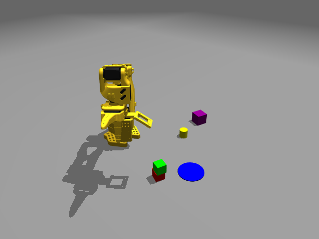
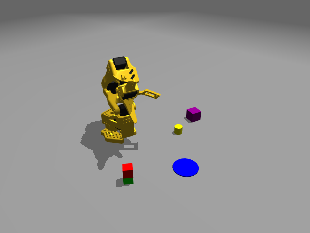
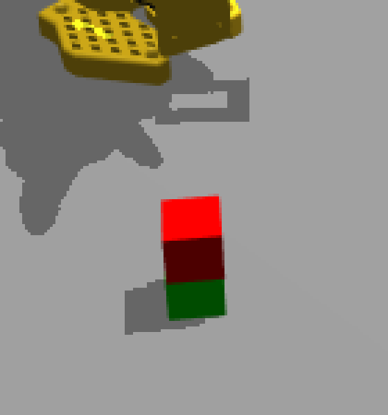

# 2026-09-17 纯 RGB 双向堆叠：绿叠红 → 红叠绿

两条自然语言指令的完整执行记录：先把绿色方块放到红色方块上，再把红色方块放到绿色方块上（后者需要先拆掉前者搭好的垛）。本文件记录从收到指令起的每一次工具调用、每一条发出与收到的信息、以及中间的判断依据，包括两处差点判断错误的地方。

原始运行目录：`LLM-control/runs/loop-20260917-150932-441800`（world-001，seed=4，两个任务共用同一世界，其间没有 `reset`）。
本目录是独立归档，快照截至事件序号 **116**，之后的服务动作不会修改这里的内容。

## 元信息

| 项目 | 值 |
| --- | --- |
| 规划模型 | **Claude Opus 5**（模型 ID `claude-opus-5`），通过 Claude Code CLI 运行 |
| 本地 Python 职责 | 颜色分割、平面估计、IK、执行器、MuJoCo 物理、任务状态与日志；不调用任何模型 API |
| 相机模态 | `rgb`（无深度），环境相机 `side`，两路 640×480 |
| 时区 | 表中为本地时间 CEST（UTC+02:00）；`events.jsonl` 中保留 UTC |
| 仿真物理时间 | 从 1.00 s 推进到 77.36 s（两任务合计 76.36 s） |

### 时长

| 任务 | 指令送达 | 对话回复结束 | 对话侧总时长 | 服务侧首末事件 | 服务侧时长 |
| --- | --- | --- | --- | --- | --- |
| A 绿叠红 | 15:10:11.97 | 15:19:22.45 | **9 分 10 秒** | 15:10:33 → 15:17:24 | 6 分 51 秒 |
| B 红叠绿 | 15:19:22.48 | 15:33:37.90 | **14 分 15 秒** | 15:19:32 → 15:26:32 | 7 分 00 秒 |

对话侧时长包含读图、推理和最后撰写回复；服务侧时长只覆盖第一次 `status` 到 `complete` 之间。

### Token 消耗

数据来自 Claude Code 会话记录 `~/.claude/projects/-home-dragon-SO101-mujoco/7d4aa268-….jsonl`，按两条用户指令的边界切分。

| 任务 | 助手轮次 | 输入（未命中缓存） | 缓存写入 | 缓存读取 | 输出 | 计费输入+输出小计 |
| --- | --- | --- | --- | --- | --- | --- |
| A 绿叠红 | 61 | 122 | 78,393 | 20,528,030 | 55,817 | **134,332** |
| B 红叠绿 | 63 | 126 | 50,418 | 23,338,407 | 49,197 | **99,741** |
| 合计 | 124 | 248 | 128,811 | 43,866,437 | 105,014 | **234,073** |

缓存读取量远大于其它项，是因为每一轮都要重新读取已缓存的上下文前缀；它按缓存价计费，不等同于新增 token。真正新增的部分是「缓存写入 + 输出」。

## 运行条件与证据边界

- 全程纯 RGB，**没有**渲染或读取深度：两个任务的运行目录内 `.npy` 文件数为 0。
- 三维坐标来自**显式平面假设**：像素射线与给定水平面求交，或给 `propose` 传 `object_height` 做双平面雕刻。假设写在每条请求里，也回显在每条结果里。
- **未读取任何物体仿真坐标、分割 ID 或射线测距**。使用的私有信息只有相机标定和机器人正运动学，两者都是真机上同样可得的量。
- 红、绿方块边长均 25 mm，桌面 z=0。这两个尺寸是场景说明给出的先验，不是从仿真读出的位姿。
- `propose` 返回的 `center` / `extent` 是估计值，不是真值；`extent` 用作调用方自检。
- `complete` 的 `succeeded` 与 `codex_visual` 是模型根据图像作出的判断，不是接触传感器，也不是自动评分。

## 汇总

| 任务 | 动作步数 / 预算 | 失败请求 | 结果 | task_id |
| --- | --- | --- | --- | --- |
| A 将绿色方块放到红色方块上方 | 13 / 40 | 0 | succeeded | `fc562793b2aa4f0190070e8ac42a93b0` |
| B 将红色方块放在绿色方块上面 | 20 / 50 | 0 | succeeded | `d050029a5af24ccfb29dc178bb944641` |

两个任务合计 33 个动作步、64 次 `propose`、0 次 IK 失败、0 次重试。

## 工具调用总览（对话侧）

| 工具 | 任务 A | 任务 B | 用途 |
| --- | --- | --- | --- |
| `Bash` | 24 | 30 | 调用 `run_loop.sh status` / `command`，以及写一个单步发送脚本、裁剪图像 |
| `Read` | 8 | 8 | 打开返回的 PNG 实际看图（JSON 里的路径不会自动变成图像） |

所有与机器人的交互都经由 `bash LLM-control/run_loop.sh command …` 走 Unix socket，没有绕过服务直接操作 MuJoCo。

第 3 次 Bash 调用时建立了辅助脚本 `step.py`（保存在会话临时目录，非项目文件），作用是：先 `status` 取回当前 `task_id` / `frame_id` / `steps`，再用这三个值组一条 `step` 请求发出。这样保证每一步都用服务自己刚返回的 ID，而不是我记忆里的 ID——协议要求陈旧的 `frame_id` 或 `expected_step` 必须被拒绝，这个脚本让我不会误触发那条规则。它一次只发一条动作。

---

# 任务 A：将绿色方块放到红色方块上方

用户原话：**将绿色方块放到红色方块上方**
服务任务文本：`将绿色方块放到红色方块上方（纯 RGB 模式）`，`max_steps=40`
事件序号 1–52，完整记录见 [task-A-green-on-red.jsonl](./task-A-green-on-red.jsonl)。

## A.0 收到指令后的前三个动作

1. **读上下文**：IDE 当时打开着 `logs/2026-09-17-rgb-three-tasks/README.md`，我先读了它，确认这是同类任务的既往归档（不是当前世界的状态）。
2. **`run_loop.sh status`**（事件 1）：确认服务在跑、`task: null`、模态为 `rgb` / `side`、`world=1`。按 `AGENTS.md` 的约定，必须先读当前任务再决定是继续、完成还是新建。
3. **`begin`**（事件 2）：新建任务并取回第一帧。返回 `frame-2`、TCP `(0.1061, -0.1878, 0.0901)`、`world=1`、`time=1.0`——run 目录是 `loop-20260917-150932`，说明这是一个**新启动的服务和新世界**，不是既往归档那三个任务的续接。

随后用 `Read` 打开 `0002-side.png` 实际看图：红、绿两块各自独立放在桌面上，黄色圆柱、紫色方块、蓝色目标区在远端。

## A.1 定位

| 事件 | 相机 / 颜色 | 假设 | 结果 |
| --- | --- | --- | --- |
| 3 | side / green | `plane_z=0, object_height=0.025` | center=(0.1881, −0.1715, 0) extent=34×34 mm cells=161 |
| 4 | side / red | `plane_z=0, object_height=0.025` | center=(0.2199, −0.0633, 0) extent=32×32 mm cells=155 |
| 10 | wrist / green | `plane_z=0, object_height=0.025` | center=(0.1881, −0.1712, 0) extent=34×34 mm cells=159 |

判断依据：25 mm 方块经双平面雕刻后的 `extent` 应在 28–36 mm（雕刻给的是外包围，比真实底面略大），`cells` 在 150–165。两项都落在预期内，才采用这个估计。

事件 10 是在夹爪已经悬停到绿块上方之后做的**腕部复核**：与侧视相差 0.3 mm，两个独立视角互相印证后才下降。

## A.2 关键推理：径向偏移

这是本次任务里唯一一个不是直接测量、而是推断出来的量，单独记录。

夹取时 SO101 只有一个活动指。闭合时活动指先接触方块，把它推到固定指上，所以**方块最终落在固定指处，而不是 TCP 处**。在本轮之前的纯 RGB 抓取验证里（同一 seed、同一红块），TCP 停在 (0.2198, −0.0632)，抬起后方块实际在 (0.2104, −0.060)——沿该方位角的径向分解为 **向基座方向偏 9.9 mm**。

既往归档 `2026-09-17-rgb-three-tasks` 的做法与此一致：抓取时 TCP 目标比估计中心**沿径向朝外**偏 7.4 mm，放置时朝外偏 7.3 mm。两条独立来源给出同一个结论。

因此本次采用的规则是：**TCP 目标 = 期望方块位置 + 7.5 mm × 径向单位向量（朝外）**。任务 A 的抓取步骤没有用这条规则（直接瞄准了中心），放置步骤用了；任务 B 三次抓放全部用了。

## A.3 动作与反馈

| 步 | 事件 | 指令 | 实际 TCP (m) | 误差 |
| --- | --- | --- | --- | --- |
| 1 | 6 | `gripper opening=1.0` | (0.1061, −0.1877, 0.0900) | — |
| 2 | 8 | `move [0.1881,−0.1715,0.0625] down` | (0.1880, −0.1714, 0.0623) | 0.2 mm |
| 3 | 12 | `move [0.1881,−0.1712,0.0125] down linear` | (0.1880, −0.1711, 0.0123) | 0.2 mm |
| 4 | 14 | `gripper opening=0.0` | 夹爪关节 1.7453 → **0.0508** | — |
| 5 | 16 | `move [0.1881,−0.1712,0.0725] down linear` | (0.1880, −0.1711, 0.0723) | 0.2 mm |
| 6 | 26 | `move [0.2199,−0.0633,0.075] down linear` | (0.2198, −0.0633, 0.0749) | 0.1 mm |
| 7 | 31 | `move [0.2273,−0.0651,0.075] down linear` | (0.2272, −0.0651, 0.0749) | 0.1 mm |
| 8 | 33 | `move [0.2273,−0.0651,0.047] down linear` | (0.2272, −0.0651, 0.0469) | 0.1 mm |
| 9 | 35 | `gripper opening=1.0` | — | — |
| 10 | 37 | `move [0.2273,−0.0651,0.085] down linear` | (0.2272, −0.0651, 0.0849) | 0.1 mm |
| 11 | 39 | `move [0.16,−0.14,0.12] position` | (0.1600, −0.1400, 0.1199) | 0.1 mm |
| 12 | 41 | `wait 2 s` | — | — |
| 13 | 47 | `look_at [0.2201,−0.063,0.037]` | (0.2296, −0.0601, 0.0812) | 见 A.6 |

夹爪关节闭合后停在 0.0508 而不是 0，说明指间有物体顶住——这是抓住的第一个迹象，但不是证据；证据在 A.4。

第 4→5 步之间抬起，第 6 步横移，第 7 步做了 7.5 mm 的径向外偏（目标 (0.2273, −0.0651) = 红块中心 (0.2201, −0.0630) 沿方位角 −16.0° 朝外 7.5 mm），第 8 步下降到 TCP z=0.047 后张开。

## A.4 抬起后的一致性检验（事件 18–24）

抬起后不能再用 `plane_z=0` 判断位置——方块已经离开桌面，那个假设失效了。我改为**扫一组候选平面**，看哪个平面下的估计与夹爪的正运动学位置最一致。TCP 当时在 (0.1880, −0.1711, 0.0723)。

| 假设平面 | 估计中心 | 与 TCP 水平距离 | cells | extent |
| --- | --- | --- | --- | --- |
| 0.000 | (0.1349, −0.1156) | **76.9 mm** | 80 | 28×42 mm |
| 0.040 | (0.1697, −0.1432) | 33.4 mm | 60 | 24×36 mm |
| 0.050 | (0.1779, −0.1500) | 23.4 mm | 54 | 24×34 mm |
| 0.055 | (0.1820, −0.1530) | 19.0 mm | 53 | 22×34 mm |
| 0.060 | (0.1867, −0.1569) | 14.3 mm | 49 | 22×34 mm |
| 0.065 | (0.1907, −0.1602) | 11.2 mm | 45 | 22×32 mm |
| 0.070 | (0.1950, −0.1630) | **10.7 mm** | 47 | 20×20 mm |

结论：方块底面在 0.060–0.070 附近，即**方块中心大致跟随 TCP 的 z**，而「仍在桌面」的假设差了 77 mm，被排除。

同时要如实记录这个估计的精度边界：`cells` 从桌面上的约 160 掉到 45–80，因为夹爪从侧视方向挡住了方块大半个轮廓。残留的 10–14 mm 偏差与被遮挡时的已知偏置同量级，**所以这是一个判据，不是一次测量**。正因为它只是判据，我没有用它去修正放置目标，放置目标仍由 A.2 的径向规则给出。

## A.5 完成验证（事件 43–50）

张开夹爪、先垂直后横向退开、静置 2 秒后，在同一帧上对绿方块检验两个互斥假设：

| 相机 | 假设 | 估计中心 | extent | cells | 判读 |
| --- | --- | --- | --- | --- | --- |
| side | `plane_z=0.025` | (0.2243, −0.0637) | 34×34 mm | 158 | 距红块实测中心 **4.4 mm** |
| side | `plane_z=0` | (0.2068, −0.0423) | 36×34 mm | 187 | 距红块 **20 mm**，位置无解释 |
| wrist | `plane_z=0.025` | (0.2241, −0.0637) | 32×34 mm | 157 | 与侧视相差 **0.2 mm** |
| wrist | `plane_z=0` | (0.2219, −0.0804) | **42×44 mm** | 292 | extent 不符合 25 mm 方块 |

第三条证据：红方块在侧视的可见轮廓从 162 cells 塌到 **8 cells**（事件 43），说明上方被覆盖。

腕部的 `plane_z=0` 那一行是本次最干净的单项判据——假设平面低于真实支撑面时，双平面雕刻会外扩，42×44 mm 直接排除了「绿方块还在桌面」。

## A.6 一处需要注意的地方：`look_at` 的落点

事件 47 的 `look_at [0.2201,−0.063,0.037]` 返回 TCP (0.2296, −0.0601, 0.0812)，与传入的点相差 44 mm。这是**正常行为**，不是失败：`look_at` 求解的是让腕部相机光轴对准该点的关节角，约束的是朝向而不是 TCP 位置。表中的「误差」列对 `look_at` 不适用。

拍到的 [0015-wrist.png](./frames/0015-wrist.png) 可见红块顶面后缘从绿块下方露出，承托着绿块，作为独立视角的旁证。

## A.7 完成证据

写入 `complete` 的 `evidence`（事件 52，`frame-15`，`verification=codex_visual`）：两相机在 `plane_z=0.025` 下相差 0.2 mm、与红块实测中心相差 4.4 mm；`plane_z=0` 假设被位置偏差和 extent 膨胀双重排除；红块可见轮廓从 162 降到 8 cells；静置 2 秒后未倾倒。



---

# 任务 B：将红色方块放在绿色方块上面

用户原话：**将红色方块放在绿色方块上面**
服务任务文本：`将红色方块放在绿色方块上面（纯 RGB 模式；当前绿在红上，需先拆垛）`，`max_steps=50`
事件序号 53–116，完整记录见 [task-B-red-on-green.jsonl](./task-B-red-on-green.jsonl)。

## B.0 第一个判断：必须先拆垛

任务 A 刚把绿放到红上，所以**红在下面，被压住，无法直接抓取**。这不是指令里写的，是从上一任务的世界状态推出来的，所以第一步仍然是 `status`（事件 53）确认上一任务已 `succeeded`、当前无活动任务，再 `begin`。

执行路径因此被拆成两段：

1. 把绿方块从 z=0.025 抓起，放到桌面一处空位；
2. 抓红方块，叠到绿方块上。

`max_steps` 相应设为 50 而不是 40。

## B.1 空位的选择

候选点必须满足三条：与其它物体足够远、在机械臂可达范围内、且**后续还要在它上方完成一次堆叠**，所以伸展半径不能太大——朝下姿态在半径约 0.23 m 处最高只到 z≈0.09，半径越大上限越低。

选定 **(0.185, −0.125)**，半径 0.223 m：距红块当时位置 71 mm（远大于两个 25 mm 方块相邻所需），距黄色圆柱、紫色方块、蓝色圆区都很远，且比绿块原位 (0.188, −0.171) 的半径 0.254 m 小 31 mm，给堆叠留出了悬停高度。

## B.2 从垛上取下绿方块

起始帧（事件 54，`frame-16`）的定位：

| 事件 | 相机 / 颜色 | 假设 | 结果 |
| --- | --- | --- | --- |
| 56 | side / green | `plane_z=0.025` | center=(0.2243, −0.0637) extent=34×34 mm cells=158 |
| 57 | side / green | `plane_z=0` | center=(0.2068, −0.0423) extent=36×34 mm cells=187（错误假设，作对照） |
| 58 | side / red | `plane_z=0` | center=(0.2155, −0.0742) extent=22×12 mm **cells=8**（被压住，不可用） |
| 64 | wrist / green | `plane_z=0.025` | center=(0.2241, −0.0635) extent=32×32 mm cells=156 |
| 65 | side / green | `plane_z=0.025` | center=(0.2243, −0.0637) extent=34×34 mm cells=158 |

事件 58 的 `cells=8` 说明红方块此刻的估计不可信，所以我没有用它，而是等拆垛之后重新测（事件 81）。

这里径向外偏 7.5 mm 尤其重要：绿方块站在 25 mm 的底座上，如果瞄准它的正中心，闭合时活动指的推力可能把它从底座上推下去。把 TCP 放在中心外侧 7.5 mm，相当于让固定指落在方块当前位置，活动指从外侧压紧，方块几乎不移动。

抓取 TCP 目标 = (0.2243, −0.0637) 沿方位角 −15.86° 朝外 7.5 mm = **(0.2315, −0.0657)**，抓取高度 z=0.0375（= 0.025 底座 + 半个方块）。

动作前还插了一步 `move [0.17,−0.1,0.13] position`（事件 60）：上一任务结束时机械臂停在 `look_at` 的姿态（非朝下），直接在垛正上方切换到朝下姿态会让腕部旋转，有扫到垛的风险，所以先退到空处再下压。

## B.3 动作与反馈

| 步 | 事件 | 指令 | 实际 TCP (m) | 误差 |
| --- | --- | --- | --- | --- |
| 1 | 60 | `move [0.17,−0.1,0.13] position` | (0.1700, −0.1000, 0.1299) | 0.1 mm |
| 2 | 62 | `move [0.2315,−0.0657,0.080] down` | (0.2314, −0.0657, 0.0799) | 0.1 mm |
| 3 | 67 | `move [0.2315,−0.0657,0.0375] down linear` | (0.2314, −0.0657, 0.0374) | 0.1 mm |
| 4 | 69 | `gripper opening=0.0` | 夹爪关节 → 0.0514 | — |
| 5 | 71 | `move [0.2315,−0.0657,0.082] down linear` | (0.2314, −0.0657, 0.0819) | 0.1 mm |
| 6 | 73 | `move [0.1912,−0.1292,0.082] down linear` | (0.1911, −0.1291, 0.0819) | 0.1 mm |
| 7 | 75 | `move [0.1912,−0.1292,0.020] down linear` | (0.1911, −0.1291, 0.0199) | 0.1 mm |
| 8 | 77 | `gripper opening=1.0` | — | — |
| 9 | 79 | `move [0.1912,−0.1292,0.085] down linear` | (0.1912, −0.1291, 0.0849) | 0.1 mm |
| 10 | 84 | `move [0.2274,−0.0653,0.0625] down` | (0.2273, −0.0653, 0.0624) | 0.1 mm |
| 11 | 88 | `move [0.2274,−0.0653,0.0125] down linear` | (0.2273, −0.0652, 0.0124) | 0.1 mm |
| 12 | 90 | `gripper opening=0.0` | 夹爪关节 → 0.0514 | — |
| 13 | 92 | `move [0.2274,−0.0653,0.078] down linear` | (0.2273, −0.0653, 0.0779) | 0.1 mm |
| 14 | 94 | `move [0.1934,−0.131,0.078] down linear` | (0.1933, −0.1309, 0.0779) | 0.1 mm |
| 15 | 96 | `move [0.1934,−0.131,0.047] down linear` | (0.1933, −0.1309, 0.0469) | 0.1 mm |
| 16 | 98 | `gripper opening=1.0` | — | — |
| 17 | 100 | `move [0.1934,−0.131,0.086] down linear` | (0.1934, −0.1310, 0.0859) | 0.1 mm |
| 18 | 102 | `move [0.15,−0.05,0.13] position` | (0.1500, −0.0500, 0.1299) | 0.1 mm |
| 19 | 104 | `wait 2 s` | — | — |
| 20 | 114 | `look_at [0.1885,−0.1274,0.037]` | (0.1508, −0.0522, 0.1364) | 朝向约束，见 A.6 |

第 7 步把绿块放到桌面用的是 TCP z=0.020；第 15 步把红块放到绿块上用的是 TCP z=0.047（= 0.025 底座 + 0.0125 半块 + 约 9.5 mm 释放余量）。

## B.4 拆垛后重新测量（事件 81–82）

| 相机 / 颜色 | 估计中心 | 半径 | extent | cells |
| --- | --- | --- | --- | --- |
| side / red | (0.2202, −0.0632) | 0.2291 m | 32×32 mm | 157 |
| side / green | (0.1872, −0.1268) | 0.2261 m | 34×34 mm | 158 |

绿块落点 (0.1872, −0.1268) 与目标 (0.185, −0.125) 相差 **2.6 mm**——这同时验证了 B.1 的选点和 A.2 的径向偏移规则。两块此时都无遮挡，`cells` 都恢复到约 158。

事件 86 又做了一次腕部复核：红块 (0.2202, −0.0633)，与侧视相差 0.1 mm，之后才下压抓取。

## B.5 完成验证（事件 106–112）

| 相机 | 颜色 | 假设 | 估计中心 | extent | cells | 判读 |
| --- | --- | --- | --- | --- | --- | --- |
| side | red | `plane_z=0.025` | (0.1895, −0.1280) | 36×32 mm | 158 | 距绿块底座 **2.6 mm** |
| side | red | `plane_z=0` | (0.1700, −0.1108) | **40×36 mm** | 190 | extent 膨胀，且距绿块 26 mm |
| wrist | red | `plane_z=0.025` | (0.1897, −0.1279) | 34×32 mm | 157 | 与侧视相差 **0.2 mm** |
| wrist | red | `plane_z=0` | (0.2001, −0.1568) | **44×46 mm** | 277 | 不符合 25 mm 方块 |
| side | green | `plane_z=0` | 无有效估计 | — | — | 轮廓被压得太碎 |

事件 112 单独查了绿方块的原始色块（不带平面假设）：仍存在，像素面积 **270**，而它自由摆放时是 **765**。约三分之二被上方物体遮住，与「红块压在它上面」一致。

## B.6 第二处需要注意的地方：腕部特写看错了

事件 114 的 `look_at` 把腕部相机放到了 (0.1508, −0.0522, 0.1364)，距被看点约 0.15 m、俯角较缓。拍出的 [0036-wrist.png](./frames/0036-wrist.png) 里红块和绿块**看起来是并排的**，而不是上下堆叠。

我没有据此下结论。做法是回到侧视原图 `0035-side.png`，用 PIL 裁出方块附近 140×150 像素并放大到 560×600（这一步只读取已保存的 PNG，不产生新的服务请求，也不消耗步数）：[0035-side-zoom.png](./frames/0035-side-zoom.png) 显示的是一根竖直叠柱——上方红面、下方绿面、只有一个影子。定量检验（B.5）与放大图一致，说明腕部那张只是视角造成的错觉。

记录这一条是因为它说明：单张远距离斜视特写不足以判定堆叠关系，需要配合几何检验或更正的视角。

## B.7 完成证据

写入 `complete` 的 `evidence`（事件 116，`frame-36`，`verification=codex_visual`）：拆垛后绿块落点与目标差 2.6 mm；红块在 `plane_z=0.025` 下两相机相差 0.2 mm、与绿块底座相差 2.6 mm；`plane_z=0` 假设被 extent 膨胀（40×36、44×46 mm）排除；绿块可见像素从 765 降到 270；放大后的侧视图显示单一竖直叠柱，黄色圆柱、紫色方块、蓝色目标区未被移动。





---

## 关键帧索引

| 帧 | 任务 | 内容 |
| --- | --- | --- |
| [0002-side](./frames/0002-side.png) | A | 初始世界：红、绿各自在桌面 |
| [0004-wrist](./frames/0004-wrist.png) | A | 悬停在绿块上方，腕部复核 |
| [0007-side](./frames/0007-side.png) | A | 绿块被夹起离开桌面 |
| [0008-wrist](./frames/0008-wrist.png) | A | 持绿块移到红块上方 |
| [0014-side](./frames/0014-side.png) | A | 绿叠红完成，机械臂已退开 |
| [0015-wrist](./frames/0015-wrist.png) | A | 独立视角：红块顶面承托绿块 |
| [0016-side](./frames/0016-side.png) | B | 任务 B 起始：绿在红上 |
| [0018-wrist](./frames/0018-wrist.png) | B | 悬停在垛顶绿块上方 |
| [0021-side](./frames/0021-side.png) | B | 绿块被取下，红块露出 |
| [0025-side](./frames/0025-side.png) | B | 拆垛完成，两块分开放置 |
| [0030-wrist](./frames/0030-wrist.png) | B | 持红块悬停在绿块上方 |
| [0035-side](./frames/0035-side.png) | B | 红叠绿完成 |
| [0035-side-zoom](./frames/0035-side-zoom.png) | B | 放大后确认竖直叠柱 |
| [0036-wrist](./frames/0036-wrist.png) | B | 易被看错的斜视特写（见 B.6） |

## 复现方法

```bash
# 启动同样配置的服务
MUJOCO_GL=egl bash LLM-control/run_loop.sh serve \
    --camera-modality rgb --environment-camera side --seed 4
# 或带窗口
bash LLM-control/run_loop.sh serve --camera-modality rgb --environment-camera side \
    --viewer --realtime --camera-viewer
```

两个任务的每一条请求和响应都在本目录的 `task-A-green-on-red.jsonl` / `task-B-red-on-green.jsonl` 里，字段与 `runs/*/events.jsonl` 完全一致（包含逐帧的完整相机内外参）。协议说明见 [LOOP_README.md](../../LOOP_README.md)，持续操作约定见根目录 `AGENTS.md`。

需要留意：动作序列里的具体坐标与本次 world-001、seed=4 的布局绑定，换 seed 或换世界必须重新 `propose`，不能照抄。
