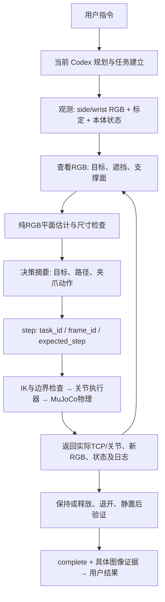

# 三任务输入输出流、模型与资源消耗

## 口径

本补充从服务事件和当前 Codex 会话的公开消息、轮次元数据、逐响应用量记录重建。决策摘要为事后整理的可复核说明，不是逐字内部推理。原始 reasoning 消息不导出。模型身份取自对应 turn_context，不能从 README 中的模型称呼反推。

## 模型与耗时

| 任务 | 模型 / effort | 用户输入到最终回复 | 服务 begin→complete | 仿真推进 | 模型响应数 |
| --- | --- | --- | --- | --- | --- |
| 1 | gpt-6-astra / low | 103.859 s | 80.902 s | 10.920 s | 11 |
| 2 | gpt-6-astra / low | 119.808 s | 105.964 s | 14.380 s | 12 |
| 3 | gpt-6-astra / low | 270.156 s | 253.791 s | 41.060 s | 28 |

用户输入到最终回复以本地 user_message 与 task_complete 时间差计，包含看图、规划、工具调用、动作和反馈。服务耗时从 begin 反馈到 complete 反馈计，不含 begin 之前的工作。仿真时间在服务空闲时暂停，不能当作真实耗时。每条工具/服务命令没有独立的可靠执行起止字段，不能把相邻事件的时间差标成推理耗时或机械臂执行耗时。

## Token 用量

| 任务 | 输入 | 其中缓存输入 | 非缓存输入 | 输出 | 其中推理输出 | 合计 |
| --- | --- | --- | --- | --- | --- | --- |
| 1 | 1,144,905 | 950,656 | 194,249 | 1,774 | 79 | 1,146,679 |
| 2 | 1,378,956 | 1,367,424 | 11,532 | 1,883 | 83 | 1,380,839 |
| 3 | 3,686,622 | 3,658,496 | 28,126 | 4,466 | 12 | 3,691,088 |

逐响应 `usage` 求和，并与最后一条 `turn_token_usage` 校验一致；没有使用整段会话累计值冒充任务用量。输入包含每次调用重复携带的上下文，缓存输入是其子集，推理输出是输出子集，均不重复加总。图像 token 没有单独拆分字段，记录为 null。token 量不等于费用，也不能从总耗时推算纯模型推理时间。

证据：[model-usage-source.jsonl](model-usage-source.jsonl)、[execution-metrics.json](execution-metrics.json)、[conversation-public.jsonl](conversation-public.jsonl)。仅提取三个操作轮次，不包含整理日志的轮次或之前未执行抓取的轮次。

## 任务1的输入输出时间线

[机器可读完整流](task-01-flow.json)：每个事件都保留完整请求/反馈、输入帧、输出图片、实际TCP和相机标定。以下是审阅索引。

| 事件 | 阶段 | 输入 → 决策摘要 → 输出 |
| --- | --- | --- |
| 2 | begin | 用户指令 → 建立任务，获取当前双RGB、本体状态和相机标定；不重置世界。 → [side](frames/0002-side.png), [wrist](frames/0002-wrist.png) |
| 3 | propose | [side](frames/0002-side.png), [wrist](frames/0002-wrist.png) → 从当前已查看RGB提取颜色候选，按显式支撑平面与物体高度估计位置，检查extent及遮挡。 → 定位/状态JSON（见完整流） |
| 4 | step | [side](frames/0002-side.png), [wrist](frames/0002-wrist.png) → 环境图确认方块独立在桌面；侧视平面估计通过尺寸检查，先以张开夹爪靠近上方。 → [side](frames/0003-side.png), [wrist](frames/0003-wrist.png) |
| 5 | propose | [side](frames/0003-side.png), [wrist](frames/0003-wrist.png) → 从当前已查看RGB提取颜色候选，按显式支撑平面与物体高度估计位置，检查extent及遮挡。 → 定位/状态JSON（见完整流） |
| 6 | step | [side](frames/0003-side.png), [wrist](frames/0003-wrist.png) → 腕部平面估计与侧视一致，沿竖直路径下降到含夹爪偏移的抓取高度。 → [side](frames/0004-side.png), [wrist](frames/0004-wrist.png) |
| 7 | step | [side](frames/0004-side.png), [wrist](frames/0004-wrist.png) → 腕部画面显示方块处于两指之间，闭合夹爪。 → [side](frames/0005-side.png), [wrist](frames/0005-wrist.png) |
| 8 | step | [side](frames/0005-side.png), [wrist](frames/0005-wrist.png) → 夹紧后向上移动45毫米，检查方块是否随夹爪离桌。 → [side](frames/0006-side.png), [wrist](frames/0006-wrist.png) |
| 9 | step | [side](frames/0006-side.png), [wrist](frames/0006-wrist.png) → 保持2秒，通过新侧视和腕部RGB检查是否滑落。 → [side](frames/0007-side.png), [wrist](frames/0007-wrist.png) |
| 10 | complete | [side](frames/0007-side.png), [wrist](frames/0007-wrist.png) → 根据释放/保持、退开及等待后的RGB证据记录任务结果。 → 定位/状态JSON（见完整流） |

## 任务2的输入输出时间线

[机器可读完整流](task-02-flow.json)：每个事件都保留完整请求/反馈、输入帧、输出图片、实际TCP和相机标定。以下是审阅索引。

| 事件 | 阶段 | 输入 → 决策摘要 → 输出 |
| --- | --- | --- |
| 12 | begin | 用户指令 → 建立任务，获取当前双RGB、本体状态和相机标定；不重置世界。 → [side](frames/0008-side.png), [wrist](frames/0008-wrist.png) |
| 13 | propose | [side](frames/0008-side.png), [wrist](frames/0008-wrist.png) → 从当前已查看RGB提取颜色候选，按显式支撑平面与物体高度估计位置，检查extent及遮挡。 → 定位/状态JSON（见完整流） |
| 14 | step | [side](frames/0008-side.png), [wrist](frames/0008-wrist.png) → 绿色方块保持夹持，使用红块桌面平面估计规划高于目标的横移路径。 → [side](frames/0009-side.png), [wrist](frames/0009-wrist.png) |
| 15 | propose | [side](frames/0009-side.png), [wrist](frames/0009-wrist.png) → 从当前已查看RGB提取颜色候选，按显式支撑平面与物体高度估计位置，检查extent及遮挡。 → 定位/状态JSON（见完整流） |
| 16 | localize | [side](frames/0009-side.png), [wrist](frames/0009-wrist.png) → 对当前图像选点进行显式平面射线求交；此输出依赖选点平面归属，不是深度测量。 → 定位/状态JSON（见完整流） |
| 17 | step | [side](frames/0009-side.png), [wrist](frames/0009-wrist.png) → 侧视图显示绿色位于红色上方；按25毫米红块高度缓慢下降，持物遮挡下不直接采用偏移的单像素平面点。 → [side](frames/0010-side.png), [wrist](frames/0010-wrist.png) |
| 18 | step | [side](frames/0010-side.png), [wrist](frames/0010-wrist.png) → 侧视对齐后打开夹爪，让绿色方块落在红色方块上。 → [side](frames/0011-side.png), [wrist](frames/0011-wrist.png) |
| 19 | step | [side](frames/0011-side.png), [wrist](frames/0011-wrist.png) → 张开夹爪向上退离堆叠，检查绿色没有跟随机械臂。 → [side](frames/0012-side.png), [wrist](frames/0012-wrist.png) |
| 20 | step | [side](frames/0012-side.png), [wrist](frames/0012-wrist.png) → 横向退开，提供无遮挡侧视证据。 → [side](frames/0013-side.png), [wrist](frames/0013-wrist.png) |
| 21 | step | [side](frames/0013-side.png), [wrist](frames/0013-wrist.png) → 静置2秒，用新图像确认堆叠稳定。 → [side](frames/0014-side.png), [wrist](frames/0014-wrist.png) |
| 22 | complete | [side](frames/0014-side.png), [wrist](frames/0014-wrist.png) → 根据释放/保持、退开及等待后的RGB证据记录任务结果。 → 定位/状态JSON（见完整流） |

## 任务3的输入输出时间线

[机器可读完整流](task-03-flow.json)：每个事件都保留完整请求/反馈、输入帧、输出图片、实际TCP和相机标定。以下是审阅索引。

| 事件 | 阶段 | 输入 → 决策摘要 → 输出 |
| --- | --- | --- |
| 24 | begin | 用户指令 → 建立任务，获取当前双RGB、本体状态和相机标定；不重置世界。 → [side](frames/0015-side.png), [wrist](frames/0015-wrist.png) |
| 25 | propose | [side](frames/0015-side.png), [wrist](frames/0015-wrist.png) → 从当前已查看RGB提取颜色候选，按显式支撑平面与物体高度估计位置，检查extent及遮挡。 → 定位/状态JSON（见完整流） |
| 26 | localize | [side](frames/0015-side.png), [wrist](frames/0015-wrist.png) → 对当前图像选点进行显式平面射线求交；此输出依赖选点平面归属，不是深度测量。 → 定位/状态JSON（见完整流） |
| 27 | step | [side](frames/0015-side.png), [wrist](frames/0015-wrist.png) → 当前绿色在红色上面，先移开绿色；以已知25毫米支撑高度估计上层位置后靠近。 → [side](frames/0016-side.png), [wrist](frames/0016-wrist.png) |
| 28 | propose | [side](frames/0016-side.png), [wrist](frames/0016-wrist.png) → 从当前已查看RGB提取颜色候选，按显式支撑平面与物体高度估计位置，检查extent及遮挡。 → 定位/状态JSON（见完整流） |
| 29 | step | [side](frames/0016-side.png), [wrist](frames/0016-wrist.png) → 腕部复核绿色定位，下降到第二层的抓取高度。 → [side](frames/0017-side.png), [wrist](frames/0017-wrist.png) |
| 30 | step | [side](frames/0017-side.png), [wrist](frames/0017-wrist.png) → 夹爪两指包围绿色方块，闭合夹爪。 → [side](frames/0018-side.png), [wrist](frames/0018-wrist.png) |
| 31 | step | [side](frames/0018-side.png), [wrist](frames/0018-wrist.png) → 抬起绿色方块，确认与下方红块分离。 → [side](frames/0019-side.png), [wrist](frames/0019-wrist.png) |
| 32 | step | [side](frames/0019-side.png), [wrist](frames/0019-wrist.png) → 移动到由RGB射线与桌面求交选定的空位上方。 → [side](frames/0020-side.png), [wrist](frames/0020-wrist.png) |
| 33 | step | [side](frames/0020-side.png), [wrist](frames/0020-wrist.png) → 沿竖直路径下降至桌面放置高度。 → [side](frames/0021-side.png), [wrist](frames/0021-wrist.png) |
| 34 | step | [side](frames/0021-side.png), [wrist](frames/0021-wrist.png) → 打开夹爪释放绿色方块。 → [side](frames/0022-side.png), [wrist](frames/0022-wrist.png) |
| 35 | step | [side](frames/0022-side.png), [wrist](frames/0022-wrist.png) → 向上退开，让相机看到绿色独立放在桌面。 → [side](frames/0023-side.png), [wrist](frames/0023-wrist.png) |
| 36 | step | [side](frames/0023-side.png), [wrist](frames/0023-wrist.png) → 静置1秒，再重新定位两块方块。 → [side](frames/0024-side.png), [wrist](frames/0024-wrist.png) |
| 37 | propose | [side](frames/0024-side.png), [wrist](frames/0024-wrist.png) → 从当前已查看RGB提取颜色候选，按显式支撑平面与物体高度估计位置，检查extent及遮挡。 → 定位/状态JSON（见完整流） |
| 38 | propose | [side](frames/0024-side.png), [wrist](frames/0024-wrist.png) → 从当前已查看RGB提取颜色候选，按显式支撑平面与物体高度估计位置，检查extent及遮挡。 → 定位/状态JSON（见完整流） |
| 39 | step | [side](frames/0024-side.png), [wrist](frames/0024-wrist.png) → 根据新侧视红块定位移动到其上方。 → [side](frames/0025-side.png), [wrist](frames/0025-wrist.png) |
| 40 | propose | [side](frames/0025-side.png), [wrist](frames/0025-wrist.png) → 从当前已查看RGB提取颜色候选，按显式支撑平面与物体高度估计位置，检查extent及遮挡。 → 定位/状态JSON（见完整流） |
| 41 | step | [side](frames/0025-side.png), [wrist](frames/0025-wrist.png) → 腕部红块估计与侧视一致，下降到桌面抓取高度。 → [side](frames/0026-side.png), [wrist](frames/0026-wrist.png) |
| 42 | step | [side](frames/0026-side.png), [wrist](frames/0026-wrist.png) → 闭合夹爪夹住红色方块。 → [side](frames/0027-side.png), [wrist](frames/0027-wrist.png) |
| 43 | step | [side](frames/0027-side.png), [wrist](frames/0027-wrist.png) → 抬起红色方块，检查其离桌且绿色仍在桌面。 → [side](frames/0028-side.png), [wrist](frames/0028-wrist.png) |
| 44 | propose | [side](frames/0028-side.png), [wrist](frames/0028-wrist.png) → 从当前已查看RGB提取颜色候选，按显式支撑平面与物体高度估计位置，检查extent及遮挡。 → 定位/状态JSON（见完整流） |
| 45 | step | [side](frames/0028-side.png), [wrist](frames/0028-wrist.png) → 重新观察绿色位置，横移至绿色方块上方。 → [side](frames/0029-side.png), [wrist](frames/0029-wrist.png) |
| 46 | propose | [side](frames/0029-side.png), [wrist](frames/0029-wrist.png) → 从当前已查看RGB提取颜色候选，按显式支撑平面与物体高度估计位置，检查extent及遮挡。 → 定位/状态JSON（见完整流） |
| 47 | step | [side](frames/0029-side.png), [wrist](frames/0029-wrist.png) → 按绿色方块25毫米高度缓慢下降；腕部绿色部分遮挡时结合完整侧视定位。 → [side](frames/0030-side.png), [wrist](frames/0030-wrist.png) |
| 48 | step | [side](frames/0030-side.png), [wrist](frames/0030-wrist.png) → 打开夹爪，把红色方块释放到绿色方块上。 → [side](frames/0031-side.png), [wrist](frames/0031-wrist.png) |
| 49 | step | [side](frames/0031-side.png), [wrist](frames/0031-wrist.png) → 向上退出，确认红色留在绿色上方。 → [side](frames/0032-side.png), [wrist](frames/0032-wrist.png) |
| 50 | step | [side](frames/0032-side.png), [wrist](frames/0032-wrist.png) → 横向退开，让侧视相机完整看到两块方块。 → [side](frames/0033-side.png), [wrist](frames/0033-wrist.png) |
| 51 | step | [side](frames/0033-side.png), [wrist](frames/0033-wrist.png) → 静置2秒，用新图像确认红上绿下保持稳定。 → [side](frames/0034-side.png), [wrist](frames/0034-wrist.png) |
| 52 | complete | [side](frames/0034-side.png), [wrist](frames/0034-wrist.png) → 根据释放/保持、退开及等待后的RGB证据记录任务结果。 → 定位/状态JSON（见完整流） |

## 后续任务应持续记录

每轮保存用户消息接收时间、turn_id、task_id、模型及 effort；每次观测保存双RGB、frame_id、标定、本体状态；每次动作保存简要依据、完整请求、实际反馈与前后帧；结束保存验证图、证据和结果。将对应轮次的逐响应用量及完成时间归档。当前补充是这三次历史任务的归档，尚未改造运行服务或安装自动会话用量采集器。

实际工具调用输入见 [tool-inputs.jsonl](tool-inputs.jsonl)：保留模型发出的 exec 脚本、时间及 call_id，可核查 RGB 打开动作和 JSON 控制请求。脚本中的 load/store 是当次工具会话变量，完整实际解析后的请求以 events.jsonl 为准，不可把这些脚本直接当作自动回放。
