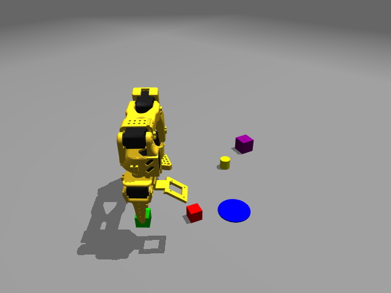
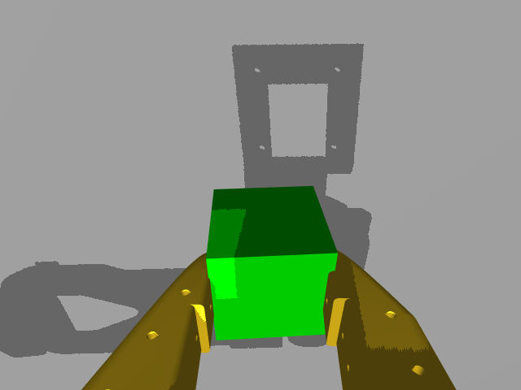
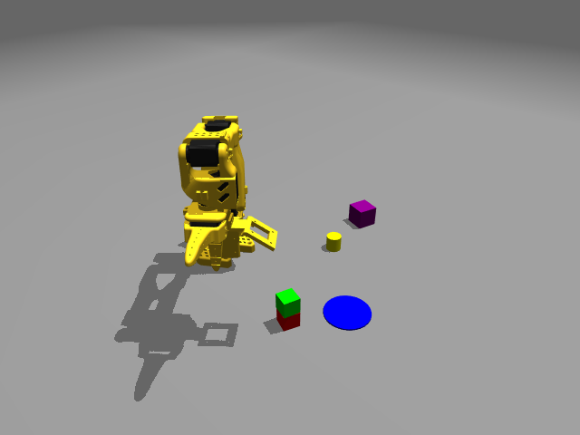
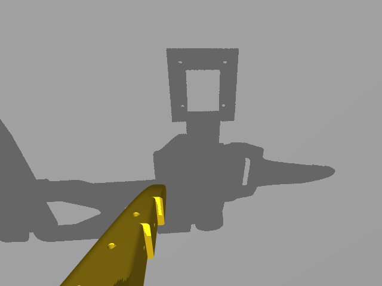
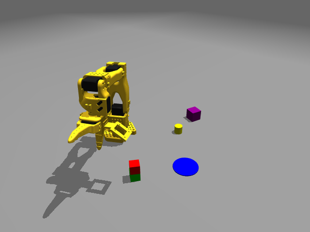
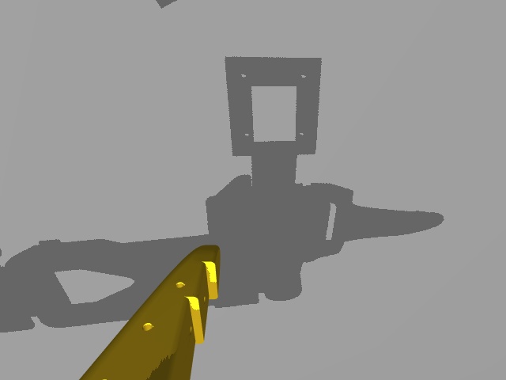

帮我继续完成SO101-MUJOCO的相机标定的工作# 2026-09-17 纯 RGB 连续操作：抓取与双向堆叠

记录最近三个任务：抓起绿色方块 → 绿叠红 → 红叠绿。三个任务使用同一世界，任务之间没有重置。

独立归档：[2026-09-17-rgb-three-tasks](./)。原始运行目录：`LLM-control/runs/loop-20260917-144747-637473`。快照截至事件序号 **52**，后续服务动作不会修改本归档。

## 运行条件与证据边界

- 模态：纯 RGB，无深度输入；固定侧视相机 + 腕部相机，640 × 480。完整相机内外参逐帧保存在事件的 observation.cameras 中。
- seed=4，world=1；红、绿方块边长均为25毫米，桌面 z=0；坐标单位米，动作表中 XYZ 换算为毫米。时间表使用 Europe/Paris（UTC+02:00），原始事件保留 UTC。
- 当前 Codex 对话规划动作；Python 负责颜色候选、平面估计、IK、关节执行器和 MuJoCo 物理步进。没有额外模型 API、物体传送或焊接。
- RGB 定位依赖显式平面假设：桌面物体 plane_z=0；已确认站在25毫米红块上的绿色方块 plane_z=0.025；object_height=0.025。propose 返回的中心和 extent 是估计，不能当成仿真真值。靠近后用腕部相机复核。
- TCP 目标含夹爪几何偏移，不等同于方块中心。腕部候选在持物遮挡时可能偏移，操作者结合完整侧视轮廓判断，没有将每个定位输出自动用于运动。
- complete 的 succeeded / codex_visual 是模型根据图像记录的结论，不是独立接触传感器或任意任务自动评分。全程未读取物体仿真坐标；夹爪退开并静置后以新图像验证堆叠。

## 汇总

| 任务 | 本地开始时间 | 本地完成时间 | 动作步数 / 预算 | 结果 |
| --- | --- | --- | --- | --- |
| 1. 抓起绿色方块 | 2026-09-17T14:48:24+02:00 | 2026-09-17T14:49:44+02:00 | 5 / 40 | succeeded；失败请求 0 |
| 2. 将绿色方块放到红色方块上 | 2026-09-17T14:52:52+02:00 | 2026-09-17T14:54:38+02:00 | 6 / 40 | succeeded；失败请求 0 |
| 3. 将红色方块放到绿色方块上 | 2026-09-17T14:59:38+02:00 | 2026-09-17T15:03:51+02:00 | 19 / 60 | succeeded；失败请求 0 |

## 任务 1：抓起绿色方块

- 用户原话：抓起绿色方块
- 服务任务文本：在纯RGB模式抓起绿色方块并保持悬空
- task_id：`196620d46da148a8ab20f950c2653452`
- 事件序号：2–10；[完整任务 JSONL](./task-01.jsonl)。

### 定位记录

| 事件 | 相机 / 颜色或像素 | 方法及假设 | 估计结果（米） |
| --- | --- | --- | --- |
| 3 | side / green | plane_z=0, height=0.025 | center=[0.18814407517185341, -0.1714661053542517, 0.0]; extent=[0.034, 0.034]; pixel=[237, 386]; cells=161 |
| 5 | wrist / green | plane_z=0, height=0.025 | center=[0.18801628998755968, -0.17119498799588748, 0.0]; extent=[0.034, 0.03400000000000003]; pixel=[338, 219]; cells=158 |

### 实际动作与反馈

| 步 | 事件 | 指令 | 实际 TCP XYZ（毫米） | 新帧 |
| --- | --- | --- | --- | --- |
| 1 | 4 | `{"action": "move", "position": [0.194, -0.176, 0.06], "seconds": 2}` | (193.95, -175.93, 59.83) | [frame-3](./frames/0003-side.png) |
| 2 | 6 | `{"action": "move", "position": [0.194, -0.176, 0.02], "seconds": 2, "linear": true}` | (193.90, -175.87, 19.83) | [frame-4](./frames/0004-side.png) |
| 3 | 7 | `{"action": "gripper", "opening": 0, "seconds": 1.5}` | (193.97, -175.98, 19.91) | [frame-5](./frames/0005-side.png) |
| 4 | 8 | `{"action": "move", "position": [0.194, -0.176, 0.065], "seconds": 2, "linear": true}` | (193.94, -175.94, 64.83) | [frame-6](./frames/0006-side.png) |
| 5 | 9 | `{"action": "wait", "seconds": 2}` | (193.94, -175.94, 64.83) | [frame-7](./frames/0007-side.png) |

### 完成证据

纯RGB操作：在当前侧视图确认绿色25毫米方块单独位于z=0桌面，以propose object_height=0.025 plane_z=0估计位置，extent两轴34毫米；靠近后腕部RGB复算一致。闭合夹爪后TCP从z=0.01991抬至0.06483米。侧视图显示绿色方块随夹爪离开桌面，腕部图显示方块持续夹在两指之间。保持2秒后的新双RGB图像显示未掉落；夹爪保持闭合。无深度输入或物体仿真真值。

## 任务 2：将绿色方块放到红色方块上

- 用户原话：放在红色方块上方
- 服务任务文本：将夹持的绿色方块放在红色方块上方，保持纯RGB模式
- task_id：`15a06f8978384624ae2a72e5942c2f78`
- 事件序号：12–22；[完整任务 JSONL](./task-02.jsonl)。

### 定位记录

| 事件 | 相机 / 颜色或像素 | 方法及假设 | 估计结果（米） |
| --- | --- | --- | --- |
| 13 | side / red | plane_z=0, height=0.025 | center=[0.21988301959969292, -0.06325875188849023, 0.0]; extent=[0.032, 0.032]; pixel=[318, 348]; cells=155 |
| 15 | wrist / red | plane_z=0, height=0.025 | center=[0.22061536293576328, -0.060607619245544087, 0.0]; extent=[0.03, 0.026000000000000002]; pixel=[338, 184]; cells=119 |
| 16 | wrist / [342, 152] | plane, plane_z=0.025 | [0.2271072181621179, -0.04768960949103681, 0.024999999999999994] |

### 实际动作与反馈

| 步 | 事件 | 指令 | 实际 TCP XYZ（毫米） | 新帧 |
| --- | --- | --- | --- | --- |
| 1 | 14 | `{"action": "move", "position": [0.227, -0.065, 0.075], "seconds": 3, "linear": true}` | (226.94, -64.98, 74.88) | [frame-9](./frames/0009-side.png) |
| 2 | 17 | `{"action": "move", "position": [0.227, -0.065, 0.047], "seconds": 2, "linear": true}` | (226.90, -64.97, 46.88) | [frame-10](./frames/0010-side.png) |
| 3 | 18 | `{"action": "gripper", "opening": 1, "seconds": 1.5}` | (226.90, -64.97, 46.87) | [frame-11](./frames/0011-side.png) |
| 4 | 19 | `{"action": "move", "position": [0.227, -0.065, 0.075], "seconds": 2, "linear": true}` | (226.93, -64.98, 74.87) | [frame-12](./frames/0012-side.png) |
| 5 | 20 | `{"action": "move", "position": [0.16, -0.14, 0.1], "seconds": 2, "orientation": "position"}` | (159.97, -139.97, 99.89) | [frame-13](./frames/0013-side.png) |
| 6 | 21 | `{"action": "wait", "seconds": 2}` | (159.97, -139.97, 99.89) | [frame-14](./frames/0014-side.png) |

### 完成证据

纯RGB模式，以红色25毫米方块直立于z=0桌面的显式假设，从当前侧视颜色轮廓估计中心及32毫米extent，靠近后查看腕部图核实。绿色方块缓慢下降后已张开夹爪，先向上再横向退开，静置2秒。最新侧视RGB清楚显示绿色方块叠在红色方块上、两者上下接合且无倾倒，与退开后的前一帧一致；机械臂已远离堆叠。结果为图像判断，未使用深度或物体仿真坐标。

## 任务 3：将红色方块放到绿色方块上

- 用户原话：将红色方块放到绿色方块上
- 服务任务文本：将红色方块放到绿色方块上；先移开上层绿色方块，再叠放红色方块，保持纯RGB
- task_id：`4571fbe8bbf446dd8dede045854fc504`
- 事件序号：24–52；[完整任务 JSONL](./task-03.jsonl)。

### 定位记录

| 事件 | 相机 / 颜色或像素 | 方法及假设 | 估计结果（米） |
| --- | --- | --- | --- |
| 25 | side / green | plane_z=0.025, height=0.025 | center=[0.21978330063206322, -0.0634299117580205, 0.025]; extent=[0.03, 0.032]; pixel=[317, 334]; cells=156 |
| 26 | side / [278, 367] | plane, plane_z=0 | [0.19479879431493657, -0.11015279720914883, 0.0] |
| 28 | wrist / green | plane_z=0.025, height=0.025 | center=[0.22000776771311661, -0.06379186126810533, 0.025]; extent=[0.032, 0.031999999999999994]; pixel=[342, 238]; cells=156 |
| 37 | side / red | plane_z=0, height=0.025 | center=[0.21988301959969292, -0.06325875188849023, 0.0]; extent=[0.032, 0.032]; pixel=[318, 348]; cells=155 |
| 38 | side / green | plane_z=0, height=0.025 | center=[0.19552034736930504, -0.11031854911033254, 0.0]; extent=[0.034, 0.034]; pixel=[278, 360]; cells=161 |
| 40 | wrist / red | plane_z=0, height=0.025 | center=[0.22015901061598847, -0.06332696989690809, 0.0]; extent=[0.034, 0.032]; pixel=[338, 192]; cells=157 |
| 44 | side / green | plane_z=0, height=0.025 | center=[0.19526511308806235, -0.11019432550784805, 0.0]; extent=[0.036000000000000004, 0.034]; pixel=[278, 360]; cells=159 |
| 46 | wrist / green | plane_z=0, height=0.025 | center=[0.19750131356069892, -0.10813940456824275, 0.0]; extent=[0.03, 0.03]; pixel=[337, 184]; cells=119 |

### 实际动作与反馈

| 步 | 事件 | 指令 | 实际 TCP XYZ（毫米） | 新帧 |
| --- | --- | --- | --- | --- |
| 1 | 27 | `{"action": "move", "position": [0.227, -0.065, 0.075], "seconds": 2}` | (226.92, -64.97, 74.87) | [frame-16](./frames/0016-side.png) |
| 2 | 29 | `{"action": "move", "position": [0.227, -0.066, 0.045], "seconds": 2, "linear": true}` | (226.90, -65.96, 44.88) | [frame-17](./frames/0017-side.png) |
| 3 | 30 | `{"action": "gripper", "opening": 0, "seconds": 1.5}` | (226.90, -65.97, 44.86) | [frame-18](./frames/0018-side.png) |
| 4 | 31 | `{"action": "move", "position": [0.227, -0.066, 0.075], "seconds": 2, "linear": true}` | (226.93, -65.98, 74.86) | [frame-19](./frames/0019-side.png) |
| 5 | 32 | `{"action": "move", "position": [0.201, -0.114, 0.075], "seconds": 2, "linear": true}` | (200.94, -113.94, 74.88) | [frame-20](./frames/0020-side.png) |
| 6 | 33 | `{"action": "move", "position": [0.201, -0.114, 0.022], "seconds": 2, "linear": true}` | (200.91, -113.93, 21.88) | [frame-21](./frames/0021-side.png) |
| 7 | 34 | `{"action": "gripper", "opening": 1, "seconds": 1.5}` | (200.91, -113.93, 21.88) | [frame-22](./frames/0022-side.png) |
| 8 | 35 | `{"action": "move", "position": [0.201, -0.114, 0.075], "seconds": 2, "linear": true}` | (200.94, -113.95, 74.88) | [frame-23](./frames/0023-side.png) |
| 9 | 36 | `{"action": "wait", "seconds": 1}` | (200.94, -113.95, 74.88) | [frame-24](./frames/0024-side.png) |
| 10 | 39 | `{"action": "move", "position": [0.227, -0.065, 0.075], "seconds": 2, "linear": true}` | (226.92, -64.98, 74.88) | [frame-25](./frames/0025-side.png) |
| 11 | 41 | `{"action": "move", "position": [0.227, -0.065, 0.02], "seconds": 2, "linear": true}` | (226.88, -64.96, 19.88) | [frame-26](./frames/0026-side.png) |
| 12 | 42 | `{"action": "gripper", "opening": 0, "seconds": 1.5}` | (226.88, -64.96, 19.86) | [frame-27](./frames/0027-side.png) |
| 13 | 43 | `{"action": "move", "position": [0.227, -0.065, 0.075], "seconds": 2, "linear": true}` | (226.93, -64.97, 74.87) | [frame-28](./frames/0028-side.png) |
| 14 | 45 | `{"action": "move", "position": [0.202, -0.114, 0.075], "seconds": 2, "linear": true}` | (201.94, -113.95, 74.88) | [frame-29](./frames/0029-side.png) |
| 15 | 47 | `{"action": "move", "position": [0.202, -0.114, 0.047], "seconds": 2, "linear": true}` | (201.92, -113.93, 46.88) | [frame-30](./frames/0030-side.png) |
| 16 | 48 | `{"action": "gripper", "opening": 1, "seconds": 1.5}` | (201.92, -113.93, 46.87) | [frame-31](./frames/0031-side.png) |
| 17 | 49 | `{"action": "move", "position": [0.202, -0.114, 0.075], "seconds": 2, "linear": true}` | (201.95, -113.95, 74.87) | [frame-32](./frames/0032-side.png) |
| 18 | 50 | `{"action": "move", "position": [0.14, -0.18, 0.1], "seconds": 2, "orientation": "position"}` | (139.97, -179.95, 99.86) | [frame-33](./frames/0033-side.png) |
| 19 | 51 | `{"action": "wait", "seconds": 2}` | (139.97, -179.95, 99.86) | [frame-34](./frames/0034-side.png) |

### 完成证据

先依据已知红色方块25毫米高度与当前RGB堆叠画面，以plane_z=0.025定位上层绿色方块，并用腕部图复核，将其移至经RGB射线与z=0桌面求交确认的旁边空位。释放、退开和等待后重新定位两块方块，抓起红色方块叠在绿色方块上。现已打开夹爪并抬起横向退开，等待2秒后最新侧视RGB显示红色在上、绿色在下，两块直立接合，堆叠与退开前后保持一致，没有倾倒。全程纯RGB、相机标定和明确平面假设，无深度或物体仿真真值。

## 归档内容

- [events.jsonl](./events.jsonl)：原始事件字节快照，包含每个请求、响应、时间、序号、frame_id、任务状态、关节状态、实际 TCP、RGB 路径及相机标定。原始绝对路径不修改，迁移后请使用下列路径映射。
- [summary.json](./summary.json)：三任务索引、时间、预算、结果和相机配置。
- [image-path-map.json](./image-path-map.json)：原始图像绝对路径到归档相对路径的映射。
- `frames/`：全部观测的两路原始 PNG，不仅保存最后画面。
- [session.json](./session.json)：归档时服务会话快照。
- `source/`：归档时本地控制代码、协议、依赖清单、Git HEAD/状态和 Nexus 文件校验清单；这是归档时文件，不承诺与已加载进程逐字节一致。没有修改运行代码，也没有重置现场。
- [SHA256SUMS](./SHA256SUMS)：归档文件完整性校验。运行记录不是 MuJoCo 物理检查点，也不能仅凭日志无损恢复当前世界。

## 输入输出流、模型、耗时与 Token 补充

详见 [完整补充报告](./FLOW_AND_USAGE.md)。包括每事件的 RGB 输入/输出、定位结果、决策摘要、机械臂请求与实际反馈，以及从对应 Codex 轮次元数据提取的模型、耗时和 token 用量。
