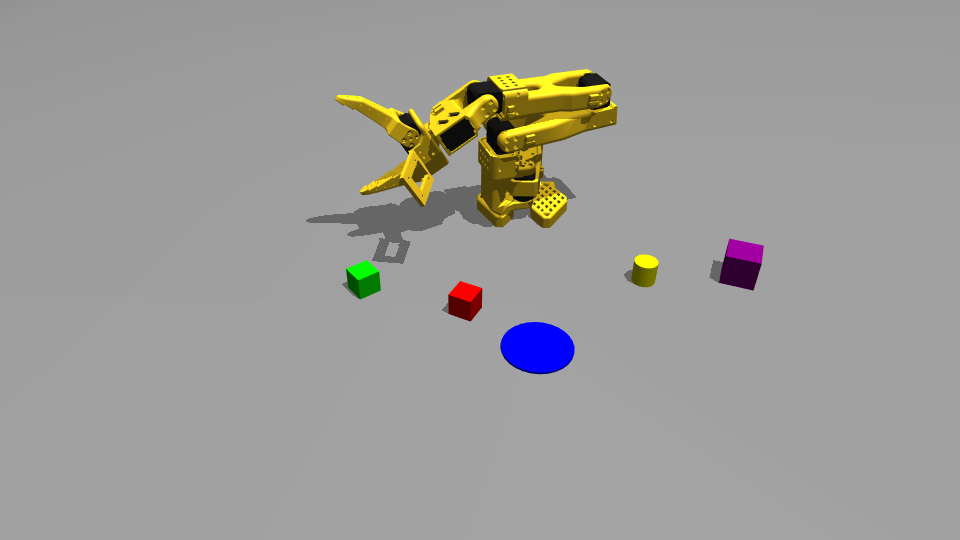
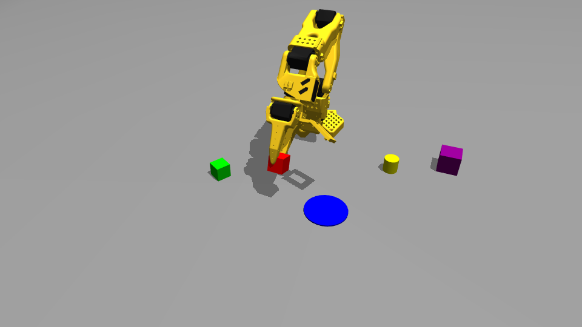
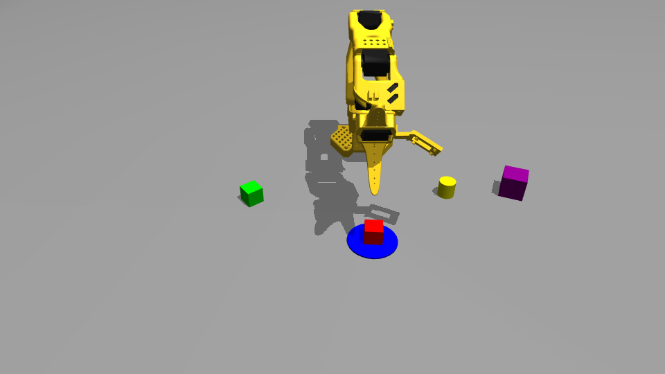

# 2026-09-19 不使用 IK 的关节级控制：抓放成功、堆叠失败

用户要求在 `LLM-control` 上**不使用逆运动学（IK）**，先按场景设计有挑战性的任务，再由对话中的模型亲自执行，并把过程记录成日志。
为此新增了不经过 IK 的底层动作 `joints`，然后只用 `joints` / `gripper` / `wait` 执行了两个任务：

- **任务 A：把红色方块抓起放入蓝色目标圆盘，成功。** 33 步，最终方块中心离圆盘中心 5.8 mm（圆盘半径 35 mm）。
- **任务 B（进阶）：把绿色方块堆到红色方块上，失败。** 53 步，5 次合爪都没夹住。事后定量复核：唯一一次成功的抓取在水平误差 4.0 mm 时合爪，
  而这 5 次失败都在 10–25 mm 水平误差、比方块中心高 7–24 mm 时合爪。运行中写下的两个原因（"自碰撞"、"约 22° 重力下垂"）经复现是错的，见 §6。

本目录是独立归档，按 [LOG_FORMAT.md](../LOG_FORMAT.md) 撰写。原始运行目录 `LLM-control/runs/loop-20260919-125131-033276`（gitignored），
快照截至事件序号 **192**（任务 B 的 `complete`）；之后两条 `status` 另存于 [events-after.jsonl](./events-after.jsonl)。
配套分析：[ANALYSIS-unknown-size.md](./ANALYSIS-unknown-size.md)（RGB 下方块尺寸从哪来、能否抓取未知尺寸物体）。

## 1. 元信息

| 项目 | 值 |
| --- | --- |
| 用户原话 | 现在使用LLM-control的组件，尝试不使用IK的方式。先根据场景设计一些有挑战性的task，然后使用对话的VLM来实现。实现的过程和必要细节记录下来写成logs |
| 规划模型 | 任务设计、实现、任务 A/B 执行、初版日志、两轮问答：**Claude Sonnet 5**（`claude-sonnet-5`）<br>本次复核、归档与提交：**Claude Opus 5**（`claude-opus-5`）<br>均通过 Claude Code（VS Code 扩展）运行；模型 ID 取自会话记录的 `message.model` |
| 本地 Python 职责 | 颜色分割、平面估计、关节执行器、MuJoCo 物理、任务状态与日志；**本次未调用 `move`/`look_at`，因此没有调用 IK**；不调用任何模型 API |
| 服务启动参数 | `run_loop.sh serve --camera-modality rgb --environment-camera calibrated --viewer --realtime --camera-viewer` |
| 相机 | 纯 RGB，无深度；环境相机 `calibrated`（复现真机 C920 标定，960×540），腕部相机 640×480 |
| 世界 | seed=4，world=1；两个任务共用同一世界，其间没有 `reset` |
| 运行目录 | 场景勘查：`runs/loop-20260919-124151-614354`（旧代码的服务）；任务 A/B：`runs/loop-20260919-125131-033276` |
| 时区 | 表中为 CEST（UTC+02:00）；jsonl 保留 UTC |
| 代码版本 | 本分支 `sim-calibrated-camera-and-no-ik-joints`：`calibrated` 相机提交 + `joints` 动作与本日志提交 |

### 时长

| 阶段 | 对话侧（CEST） | 对话侧时长 | 服务侧 begin→complete | 助手响应数 |
| --- | --- | --- | --- | --- |
| 任务设计、实现 `joints`、测试、重启服务 | 12:44:05 → 12:51:34 | 7.5 min | — | 49 |
| 任务 A 执行 | 12:51:37 → 12:58:38 | 7.0 min | 426 s | 55 |
| 任务 B 执行 | 12:58:44 → 13:14:27 | 15.7 min | 946 s | 90 |
| 初版日志、全量测试、汇报 | 13:14:39 → 13:16:55 | 2.3 min | — | 5 |
| 问答：尺寸来源 | 13:41:35 → 13:42:05 | 0.5 min | — | 2 |
| 分析：未知尺寸能否抓取 | 13:45:51 → 13:46:50 | 1.0 min | — | 2 |

对话侧时长包含看图、推理、工具调用和物理执行；服务侧时长只覆盖 `begin` 到 `complete` 两条事件。仿真物理时间从 1.0 s 推进到 159.1 s，服务空闲时暂停，不能换算成真实耗时。

### Token

来源：Claude Code 会话记录 `~/.claude/projects/-home-dragon-SO101-mujoco/d188e17d-….jsonl`，按 `message.id` 去重后逐响应求和，按上表时间窗口切分；机器可读版见 [metrics.json](./metrics.json)。

| 阶段 | 模型 | 输入（未命中缓存） | 缓存写入 | 缓存读取 | 输出 |
| --- | --- | --- | --- | --- | --- |
| 设计与实现 | sonnet-5 | 98 | 167,217 | 7,505,890 | 36,175 |
| 任务 A | sonnet-5 | 110 | 48,822 | 11,639,636 | 23,757 |
| 任务 B | sonnet-5 | 180 | 86,036 | 24,944,182 | 51,695 |
| 初版日志 | sonnet-5 | 10 | 21,949 | 1,640,561 | 9,279 |
| 两轮问答/分析 | sonnet-5 | 8 | 10,439 | 1,379,465 | 10,351 |
| **合计** | | **406** | **334,463** | **47,109,734** | **131,257** |

缓存读取是每一轮重读已缓存的上下文前缀，按缓存价计费，不等于新增内容；新增部分主要是"缓存写入 + 输出"。
任务 B 的用量约为任务 A 的两倍，与步数（53 vs 33）和反复失败重试一致。本次归档轮（Opus 5）在写文件时尚未结束，未计入。
同一会话此前还完成了"真机 C920 标定映射到仿真"（Opus 5，18.0 min，输出 37,885），它是本次所用 `calibrated` 相机的来源，数据列在 `metrics.json` 的 `context` 字段。

## 2. 运行条件与证据边界

- **不使用 IK 的含义**：`move`/`look_at` 会在服务里对目标 XYZ 做数值逆解（`solve_ik`，`least_squares`）；本次一次都没调用。
  模型也没有在对话里另写雅可比/逆解代替它，只用**正向**信息（服务返回的实际关节角、`robot.tcp`、图像）做试探和比例修正。
  用到的几何计算只有由 XY 坐标算方位角（`atan2`）和到底座的水平距离，用来判断 `shoulder_pan` 该转多少、还差多远，这是单关节瞄准和误差度量，不是整条链的逆解。
- 纯 RGB，无深度（运行目录里没有 `.npy`）。三维来自显式平面假设：`propose` 传 `object_height=0.025`、`plane_z=0`，`localize` 传 `plane_z`。
- 方块 25 mm、圆盘半径 35 mm 这些尺寸来自服务返回的场景说明（`scene.objects`），是给定先验，不是测出来的；位置全部靠图像估计。
  详见 [ANALYSIS-unknown-size.md](./ANALYSIS-unknown-size.md)。
- 没有读取任何物体的仿真坐标、分割 ID 或测距。§6 的事后复现用到了仿真内部接触信息，那是**离线诊断**，不是任务执行时的输入。
- `complete` 的 `succeeded`/`failed` 与 `codex_visual` 是模型看图作出的判断，不是接触传感器或自动评分。

## 3. 汇总

| 任务 | 动作步数 / 预算 | 被拒请求 | 结果 | task_id |
| --- | --- | --- | --- | --- |
| A 红色方块放入蓝色目标圆盘 | 33 / 150 | 0 | succeeded | `ed1e0bc136ef47149e2d9ebcb5f74dd7` |
| B 绿色方块堆到红色方块上 | 53 / 150 | 2（`elbow_flex` 目标越限，被拒且不移动） | failed | `432c51799c54428ca7cd10ff05028c0c` |

### 实现：新增 `joints` 动作

```json
{"action": "joints", "delta_deg": {"shoulder_pan": 8, "wrist_flex": -5}, "seconds": 1.0}
{"action": "joints", "target_deg": {"elbow_flex": 60}, "seconds": 1.5}
```

- 5 个手臂关节 `shoulder_pan`、`shoulder_lift`、`elbow_flex`、`wrist_flex`、`wrist_roll`（与真机舵机 ID 1–5、`extrinsics.json` 的 `joint_convention` 一致）；夹爪仍用 `gripper`。
- `delta_deg` 与 `target_deg` 二选一；`delta_deg` 每关节每步不超过 ±25°；超出关节行程直接拒绝、不移动，并报告上下限。未提到的关节保持原目标。
- `observe` 新增 `robot.joint_names`、`joints_deg`（实际角）、`joint_limits_deg`。
- 第一次 `begin` 发出时，服务还是改代码前启动的旧进程，`step` 被拒（`events-setup.jsonl` 第 12 行）；经 `shutdown` 正常关闭后用新代码重启，再重新 `begin`。

### 场景勘查（旧服务 frame-2，`events-setup.jsonl` 第 3–9 行）

| 物体 | 方法与假设 | 估计中心 (m) | extent 自检 |
| --- | --- | --- | --- |
| 红色方块 | propose, `plane_z=0, h=0.025` | (0.2199, −0.0631) | 32×34 mm，通过 |
| 绿色方块 | 同上 | (0.1879, −0.1714) | 34×34 mm，通过 |
| 黄色圆柱 | 同上；**第一个候选是黄色机械臂本身**（extent 450×402 mm），取第二个 | (0.1632, 0.1254) | 26×26 mm，通过 |
| 紫色方块 | `locate_color` 不支持 purple，未定位；作为需要避开的物体 | — | — |
| 蓝色圆盘 | propose 取像素 (537, 348)，再 `localize plane_z=0` | (0.2735, 0.0070) | 平面物体，无需高度 |



## 4. 任务 A：红色方块放入蓝色目标圆盘（成功）

- 服务任务文本：不使用逆运动学(IK)，仅用关节级点动(joints，delta_deg/target_deg)加夹爪开合，把红色方块抓起并放入蓝色目标圆盘。……
- 事件 2–70，完整记录：[task-A-red-to-goal.jsonl](./task-A-red-to-goal.jsonl)

### 4.1 方法：探针 + 比例修正

1. **方位角**：先把 `shoulder_pan` 转 +10° 作探针，观察到 TCP 方位角变化 −9.1°（比例约 −0.91），再按方位差分三步转过去，第 4 步对齐到约 1°。
2. **高度与伸出**：逐个关节探针，得到这台臂在该姿态区域的经验方向：`shoulder_lift` 增大 → 主要下降（约 −2.8 mm/°），水平影响小；
   `elbow_flex` 减小 → 伸出，同时明显升高；`wrist_flex` 减小 → 升高（第 10 步，与直觉相反），增大 → 下降并回缩。
3. **交替收敛**：`elbow_flex` 伸出一点 → `shoulder_lift` 把高度补回去 → 看 TCP 与图像，重复。第 19 步各轴残差都在 3 mm 内（水平 4.0 mm，z=13.7 mm，方块中心 12.5 mm）。
4. **合爪与核验**：合爪后腕部图双爪贴住方块两侧（0022）；上抬 58 mm 后环境相机看到方块随夹爪离桌（0023）。
5. **放置**：抬到 z≈100 mm 转运，`shoulder_pan` −21° 转向圆盘，再用同样的交替方法对准圆盘中心（残差 <2 mm），张开、退开、静置。

### 4.2 动作与反馈

| 步 | 事件 | 指令 | 结果关节 [pan, lift, elbow, wflex, wroll]（°） | 实际 TCP（mm） | 新帧 | 说明 |
| --- | --- | --- | --- | --- | --- | --- |
| 1 | 4 | `joints delta_deg: shoulder_pan: 10, seconds: 1.0` | 80.0, -85.0, 85.0, 30.0, 0.0 | (72.5, -196.5, 90.0) | 3 | pan 探针：方位角 −9.1°，比例≈−0.91 |
| 2 | 6 | `joints delta_deg: shoulder_pan: -25, seconds: 1.2` | 55.0, -85.0, 85.0, 30.0, 0.0 | (152.4, -163.9, 90.0) | 4 |  |
| 3 | 8 | `joints delta_deg: shoulder_pan: -25, seconds: 1.2` | 30.0, -85.0, 85.0, 30.0, 0.0 | (211.0, -100.5, 90.0) | 5 |  |
| 4 | 10 | `joints delta_deg: shoulder_pan: -10, seconds: 0.8` | 20.0, -85.0, 85.0, 30.0, 0.0 | (225.9, -69.1, 90.0) | 6 | 方位角对齐到约 1° |
| 5 | 12 | `joints delta_deg: shoulder_lift: 15, seconds: 1.0` | 20.0, -70.0, 85.0, 30.0, 0.0 | (214.0, -64.8, 47.1) | 7 | lift 探针：z −43 mm，水平几乎不变 |
| 6 | 14 | `gripper opening: 1.0, seconds: 1.0` | 20.0, -70.0, 85.0, 30.0, 0.0 | (214.0, -64.8, 47.1) | 8 | 提前张开夹爪 |
| 7 | 16 | `joints delta_deg: shoulder_lift: 10, seconds: 1.0` | 20.0, -60.0, 85.0, 30.0, 0.0 | (200.4, -59.9, 21.1) | 9 |  |
| 8 | 18 | `joints delta_deg: elbow_flex: -10, seconds: 0.8` | 20.0, -60.0, 75.0, 30.0, 0.0 | (225.9, -69.1, 62.9) | 10 | elbow 探针：伸出 +25 mm，同时 z +42 mm（耦合） |
| 9 | 20 | `joints delta_deg: shoulder_lift: 12, seconds: 0.8` | 20.0, -48.0, 75.0, 30.0, 0.0 | (212.0, -64.1, 28.9) | 11 |  |
| 10 | 22 | `joints delta_deg: wrist_flex: -10, seconds: 0.8` | 20.0, -48.0, 75.0, 20.0, 0.0 | (231.3, -71.1, 47.6) | 12 | wrist_flex 探针：z 反而升高 |
| 11 | 24 | `joints delta_deg: wrist_flex: 20, seconds: 0.8` | 20.0, -48.1, 74.9, 39.9, -0.0 | (190.8, -56.4, 15.0) | 13 | 反向 +20°：z 到 15 mm，但径向超调 |
| 12 | 26 | `joints delta_deg: elbow_flex: -8, seconds: 0.8` | 20.0, -48.0, 67.0, 40.0, -0.0 | (214.0, -64.8, 43.2) | 14 |  |
| 13 | 28 | `joints delta_deg: shoulder_lift: 11, seconds: 0.8` | 20.0, -37.0, 67.0, 40.0, -0.0 | (198.2, -59.0, 14.7) | 15 |  |
| 14 | 30 | `joints delta_deg: elbow_flex: -6, seconds: 0.6` | 20.0, -37.0, 61.0, 40.0, -0.0 | (217.7, -66.2, 35.2) | 16 |  |
| 15 | 32 | `joints delta_deg: shoulder_lift: 8, seconds: 0.6` | 20.0, -29.0, 61.0, 40.0, -0.0 | (205.6, -61.7, 13.6) | 17 |  |
| 16 | 34 | `joints delta_deg: elbow_flex: -4, seconds: 0.5` | 20.0, -29.0, 57.0, 40.0, -0.0 | (219.3, -66.7, 26.5) | 18 |  |
| 17 | 36 | `joints delta_deg: shoulder_lift: 5, seconds: 0.5` | 20.0, -24.0, 57.0, 40.0, -0.0 | (211.6, -63.9, 13.0) | 19 |  |
| 18 | 38 | `joints delta_deg: elbow_flex: -3, seconds: 0.5` | 20.0, -24.0, 54.0, 40.0, -0.0 | (221.8, -67.7, 22.1) | 20 |  |
| 19 | 40 | `joints delta_deg: shoulder_lift: 3, seconds: 0.4` | 20.0, -21.0, 54.0, 40.0, -0.0 | (217.0, -65.9, 13.7) | 21 | 合爪前：水平误差 4.0 mm，z=13.7 mm |
| 20 | 42 | `gripper opening: 0.0, seconds: 1.2` | 20.0, -21.1, 53.5, 39.9, -0.0 | (219.4, -66.9, 15.9) | 22 | 合爪；腕部图双爪贴合 |
| 21 | 44 | `joints delta_deg: shoulder_lift: -20, seconds: 1.2` | 20.0, -41.0, 54.1, 40.0, -0.0 | (241.0, -74.6, 74.4) | 23 | 上抬 +58 mm，方块随夹爪离桌 |
| 22 | 46 | `joints delta_deg: shoulder_lift: -8, seconds: 0.8` | 20.0, -49.0, 54.1, 40.0, -0.0 | (244.8, -76.0, 100.6) | 24 |  |
| 23 | 48 | `joints delta_deg: shoulder_pan: -21, seconds: 1.2` | -1.0, -49.0, 54.1, 40.0, -0.0 | (258.4, 2.9, 100.6) | 25 | pan −21° 转向目标圆盘 |
| 24 | 50 | `joints delta_deg: shoulder_lift: 25, seconds: 1.2` | -1.0, -24.0, 54.0, 40.0, -0.0 | (233.9, 2.4, 22.1) | 26 |  |
| 25 | 52 | `joints delta_deg: elbow_flex: -10, seconds: 0.8` | -1.0, -24.0, 44.0, 40.0, -0.0 | (267.3, 3.0, 57.4) | 27 |  |
| 26 | 54 | `joints delta_deg: shoulder_lift: 16` | -1.0, -10.7, 43.3, 39.9, -0.0 | (251.4, 2.6, 15.9) | 28 |  |
| 27 | 56 | `joints delta_deg: elbow_flex: -6, seconds: 0.6` | -1.0, -8.0, 38.0, 40.0, -0.0 | (266.2, 3.0, 23.3) | 29 |  |
| 28 | 58 | `joints delta_deg: shoulder_lift: 4` | -1.0, -5.6, 37.9, 40.0, -0.0 | (262.8, 2.8, 15.6) | 30 |  |
| 29 | 60 | `joints delta_deg: elbow_flex: -4, seconds: 0.5` | -1.0, -4.0, 34.0, 40.0, -0.0 | (274.2, 3.1, 22.1) | 31 |  |
| 30 | 62 | `joints delta_deg: shoulder_lift: 3` | -1.0, -2.0, 33.9, 40.0, -0.0 | (271.6, 3.0, 15.8) | 32 | 释放前：离圆盘中心 <2 mm |
| 31 | 64 | `gripper opening: 1.0, seconds: 1.0` | -1.0, -1.3, 33.9, 40.0, 0.0 | (270.0, 3.0, 12.9) | 33 | 释放 |
| 32 | 66 | `joints delta_deg: shoulder_lift: -25, seconds: 1.0` | -1.0, -26.0, 34.1, 40.0, 0.0 | (294.6, 3.5, 105.8) | 34 | 退开 |
| 33 | 68 | `wait seconds: 1.0` | -1.0, -26.0, 34.1, 40.0, 0.0 | (294.6, 3.5, 105.8) | 35 | 静置 1 s |

### 4.3 完成证据

`propose` 复核最终帧：红色方块中心 (0.2679, 0.0089)，圆盘中心 (0.2735, 0.0070)，相距 **5.8 mm**；方块半对角线约 17 mm，完全落在半径 35 mm 的圆盘内。夹爪已退开，静置 1 s 后位置不变。




## 5. 任务 B：绿色方块堆到红色方块上（失败）

- 服务任务文本：不使用逆运动学(IK)，仅用关节级点动(joints)加夹爪，把绿色方块抓起并精确堆叠到刚才放好的红色方块上方……
- 事件 71–192，完整记录：[task-B-green-on-red.jsonl](./task-B-green-on-red.jsonl)
- 计划的放置目标：红块中心 (0.268, 0.009)，堆叠高度 z = 0.025 + 0.0125 = 0.0375 m。
  曾试过用单个像素在 `plane_z=0.025` 反投影求红块顶面中心，得到 (0.2815, 0.0070)，与 `propose` 中心差 13 mm（像素代表点的视差），弃用。
  实际上始终没有走到放置这一步。

### 5.1 动作与反馈

| 步 | 事件 | 指令 | 结果关节 [pan, lift, elbow, wflex, wroll]（°） | 实际 TCP（mm） | 新帧 | 说明 |
| --- | --- | --- | --- | --- | --- | --- |
| 1 | 78 | `joints delta_deg: shoulder_pan: 24` | 23.0, -26.0, 34.1, 40.0, 0.0 | (273.9, -100.9, 105.8) | 38 |  |
| 2 | 80 | `joints delta_deg: shoulder_pan: 24` | 47.0, -26.0, 34.1, 40.0, 0.0 | (212.6, -187.8, 105.8) | 39 |  |
| 3 | 82 | `joints delta_deg: shoulder_lift: 25` | 46.9, -6.7, 33.9, 40.0, -0.0 | (202.3, -176.2, 32.7) | 40 | 下降到 z=33 mm |
| 4 | 84 | `joints delta_deg: elbow_flex: 5` | 46.9, -11.3, 38.9, 40.0, -0.0 | (195.1, -168.5, 32.2) | 41 |  |
| 5 | 86 | `joints delta_deg: shoulder_lift: 7` | 46.9, -11.3, 38.9, 40.0, -0.0 | (195.1, -168.5, 32.2) | 42 | 零位移（夹爪顶在方块侧面，见 0043） |
| 6 | 89 | `joints delta_deg: shoulder_lift: 5` | 46.9, -11.3, 38.9, 40.0, -0.0 | (195.1, -168.5, 32.2) | 43 | 零位移 |
| 7 | 91 | `joints delta_deg: shoulder_lift: -18` | 46.9, -11.3, 38.9, 40.0, -0.0 | (195.1, -168.5, 32.2) | 44 | 零位移 |
| 8 | 93 | `joints delta_deg: elbow_flex: 15` | 46.9, -16.7, 44.3, 40.0, -0.0 | (187.4, -160.3, 31.9) | 45 | 仅动 5.5°，部分脱困 |
| 9 | 95 | `joints delta_deg: shoulder_lift: -25` | 47.0, -32.0, 54.0, 40.0, -0.0 | (179.1, -151.8, 46.0) | 46 | lift 上抬，脱困 |
| 10 | 97 | `joints delta_deg: elbow_flex: -8` | 47.0, -32.0, 46.1, 40.0, -0.0 | (194.8, -168.7, 77.2) | 47 |  |
| 11 | 99 | `joints delta_deg: shoulder_lift: 23` | 47.0, -9.1, 36.1, 39.9, -0.0 | (199.4, -173.3, 33.8) | 48 |  |
| 12 | 101 | `joints delta_deg: elbow_flex: 5` | 47.0, -9.1, 36.1, 39.9, -0.0 | (199.4, -173.3, 33.8) | 49 | 零位移（再次接触） |
| 13 | 103 | `joints delta_deg: shoulder_lift: -20` | 47.0, -29.0, 51.0, 40.0, -0.0 | (183.0, -156.0, 47.7) | 50 | 脱困；随后 propose 发现方块已被推移约 4.5 cm |
| 14 | 106 | `joints delta_deg: elbow_flex: 12` | 47.0, -29.1, 54.4, 39.9, -0.0 | (176.0, -148.3, 36.2) | 51 |  |
| 15 | 108 | `joints delta_deg: elbow_flex: 10` | 47.0, -29.1, 54.4, 39.9, -0.0 | (176.0, -148.3, 36.2) | 52 | 零位移 |
| 16 | 110 | `joints delta_deg: shoulder_lift: -15` | 47.0, -44.1, 65.7, 39.9, 0.0 | (165.0, -136.6, 37.9) | 53 | 脱困 |
| 17 | 112 | `joints delta_deg: shoulder_lift: 10` | 47.0, -34.1, 58.5, 39.9, -0.0 | (171.4, -143.4, 36.2) | 54 |  |
| 18 | 114 | `gripper opening: 0.0, seconds: 1.2` | 47.0, -34.1, 58.5, 39.9, -0.0 | (171.4, -143.4, 36.2) | 55 | 合爪 #1（水平误差 16.5 mm，z=36 mm） |
| 19 | 116 | `joints delta_deg: shoulder_lift: -20` | 47.0, -54.1, 72.1, 39.9, 0.0 | (161.0, -132.4, 39.9) | 56 | 上抬：未夹住 |
| 20 | 120 | `gripper opening: 1.0, seconds: 0.8` | 47.0, -54.1, 72.1, 39.9, 0.0 | (161.0, -132.4, 39.9) | 57 |  |
| 21 | 122 | `joints delta_deg: elbow_flex: 6` | 47.0, -54.1, 72.1, 39.9, 0.0 | (161.0, -132.4, 39.9) | 58 | 零位移 |
| 22 | 125 | `joints delta_deg: shoulder_lift: -15` | 47.0, -69.0, 79.1, 40.0, 0.0 | (161.2, -132.6, 50.2) | 59 |  |
| 23 | 127 | `joints delta_deg: elbow_flex: 10, seconds: 2.5` | 47.0, -69.1, 82.1, 39.9, 0.0 | (156.5, -127.5, 38.0) | 60 |  |
| 24 | 129 | `joints delta_deg: shoulder_lift: 14, seconds: 2.5` | 46.9, -55.1, 74.0, 39.9, -0.0 | (158.2, -129.2, 35.0) | 61 |  |
| 25 | 131 | `joints delta_deg: wrist_flex: 15, seconds: 2` | 46.9, -55.1, 70.0, 55.0, -0.0 | (141.8, -111.7, 29.0) | 62 |  |
| 26 | 133 | `gripper opening: 0.0, seconds: 1.2` | 46.9, -55.1, 70.0, 55.0, -0.0 | (141.8, -111.7, 29.0) | 63 | 合爪 #2（13.9 mm，z=29 mm） |
| 27 | 135 | `joints delta_deg: shoulder_lift: -20, seconds: 1.5` | 47.0, -75.1, 80.0, 54.9, -0.0 | (143.3, -113.2, 34.7) | 64 | 上抬：未夹住 |
| 28 | 137 | `joints delta_deg: wrist_flex: -20, seconds: 1.5` | 47.0, -75.1, 87.4, 34.9, -0.0 | (160.1, -131.3, 40.2) | 65 |  |
| 29 | 139 | `joints delta_deg: shoulder_lift: -25, seconds: 1.5` | 47.0, -100.0, 89.1, 35.0, -0.0 | (172.1, -144.3, 101.3) | 66 | lift 到限位 −100° |
| 30 | 141 | `gripper opening: 1.0, seconds: 0.8` | 47.0, -100.0, 89.1, 35.0, -0.0 | (172.1, -144.3, 101.4) | 67 |  |
| 31 | 145 | `joints delta_deg: shoulder_lift: 25, seconds: 1.5` | 47.0, -75.1, 87.6, 34.9, -0.0 | (159.8, -131.0, 39.5) | 68 |  |
| 32 | 147 | `joints delta_deg: shoulder_lift: 12, seconds: 1.5` | 47.0, -63.1, 80.8, 34.9, -0.0 | (160.3, -131.4, 37.2) | 69 |  |
| 33 | 149 | `joints delta_deg: wrist_flex: 12, seconds: 1.5` | 46.9, -63.1, 76.6, 47.0, -0.0 | (150.1, -120.5, 33.4) | 70 |  |
| 34 | 151 | `joints delta_deg: wrist_flex: 10, seconds: 1.5` | 46.9, -63.1, 73.7, 57.0, -0.0 | (139.3, -108.9, 30.3) | 71 |  |
| 35 | 153 | `gripper opening: 0.0, seconds: 1.3` | 46.9, -63.1, 73.7, 57.0, -0.0 | (139.3, -108.9, 30.3) | 72 | 合爪 #3（19.8 mm，z=30 mm） |
| 36 | 155 | `joints delta_deg: shoulder_lift: -25, seconds: 1.5` | 47.0, -88.1, 85.7, 56.9, -0.0 | (144.3, -114.4, 36.5) | 73 | 上抬：未夹住 |
| 37 | 157 | `joints target_deg: wrist_flex: 40, seconds: 1.2` | 47.0, -88.0, 89.1, 40.0, -0.0 | (162.1, -133.6, 55.7) | 74 | wrist_flex 绝对设回 40°（任务 A 的值） |
| 38 | 160 | `joints delta_deg: elbow_flex: 8, seconds: 1.2` | — | (—) | — | ERROR 被拒：elbow 的**目标值**已接近上限 |
| 39 | 162 | `joints delta_deg: elbow_flex: 7, seconds: 1.2` | 47.0, -88.1, 92.8, 39.9, -0.0 | (157.9, -129.0, 39.4) | 76 |  |
| 40 | 164 | `joints delta_deg: shoulder_lift: 25, seconds: 1.5` | 47.0, -63.1, 79.7, 39.9, -0.0 | (155.1, -125.9, 32.9) | 77 |  |
| 41 | 166 | `joints delta_deg: shoulder_lift: 15, seconds: 1.5` | 47.0, -48.1, 70.5, 39.9, -0.0 | (158.6, -129.7, 30.5) | 78 |  |
| 42 | 168 | `joints delta_deg: elbow_flex: 18, seconds: 1.5` | — | (—) | — | ERROR 被拒：目标值≈96°，实际 70.5° |
| 43 | 170 | `wait seconds: 1.5` | 47.0, -48.1, 70.5, 39.9, -0.0 | (158.6, -129.7, 30.5) | 80 | wait：实际角不变 |
| 44 | 172 | `joints target_deg: shoulder_lift: -25, elbow_flex: 75, wrist_flex: 40, seconds: 2` | 47.0, -25.1, 53.4, 39.9, -0.0 | (174.4, -146.6, 27.8) | 81 | elbow 目标 75，实际 53.4；同一组目标在干净仿真中复现为夹爪压桌（停在 58°），见 §6.2 |
| 45 | 174 | `joints target_deg: elbow_flex: 90, seconds: 2` | 47.0, -25.1, 53.4, 39.9, -0.0 | (174.4, -146.6, 27.8) | 82 | 零位移（同上） |
| 46 | 176 | `joints target_deg: elbow_flex: 53, wrist_flex: 58, seconds: 2` | 47.0, -25.1, 51.0, 57.9, -0.0 | (147.9, -118.3, 19.3) | 83 |  |
| 47 | 178 | `gripper opening: 0.0, seconds: 1.3` | 47.0, -25.1, 51.0, 57.9, -0.0 | (147.9, -118.3, 19.3) | 84 | 合爪 #4（10.3 mm，z=19 mm） |
| 48 | 180 | `joints target_deg: shoulder_lift: -60, seconds: 1.5` | 47.0, -60.0, 53.0, 58.0, -0.0 | (167.4, -139.4, 102.4) | 85 | 上抬：未夹住 |
| 49 | 183 | `joints target_deg: shoulder_lift: -15, elbow_flex: 50, wrist_flex: 78, seconds: 2` | 47.0, -15.1, 41.2, 78.0, -0.0 | (123.1, -91.8, 20.6) | 86 |  |
| 50 | 185 | `joints delta_deg: wrist_flex: 6` | 47.0, -15.0, 50.0, 84.0, 0.0 | (89.4, -55.6, 14.5) | 87 |  |
| 51 | 187 | `joints delta_deg: wrist_flex: -8` | 47.0, -15.1, 40.2, 76.0, -0.0 | (129.4, -98.4, 21.5) | 88 |  |
| 52 | 189 | `gripper opening: 0.0, seconds: 3.0` | 47.0, -15.1, 40.2, 76.0, -0.0 | (129.4, -98.4, 21.5) | 89 | 慢速合爪 #5（25.3 mm，z=21.5 mm） |
| 53 | 191 | `joints target_deg: shoulder_lift: -50, seconds: 1.5` | 47.0, -50.0, 50.0, 76.0, -0.0 | (138.5, -108.3, 63.9) | 90 | 上抬：未夹住 |

### 5.2 每次合爪时的误差（事后用 `events.jsonl` 与合爪前最近一次 `propose` 计算）

| 合爪 | 合爪事件 | 合爪前 TCP (mm) | 当时的方块估计 (mm) | 水平误差（径向 / 切向） | TCP 高度 | 夹爪轴偏离竖直 | 结果 |
| --- | --- | --- | --- | --- | --- | --- | --- |
| 任务 A | 42 | (217.0, −65.9, 13.7) | (219.9, −63.1) | **4.0**（−2.0 / −3.5） | 13.7 | 17° | 夹住 |
| B #1 | 114 | (171.4, −143.4, 36.2) | (157.9, −133.9) | 16.5（+16.4 / +1.5） | 36.2 | 26° | 未夹住 |
| B #2 | 133 | (141.8, −111.7, 29.0) | (146.4, −124.8) | 13.9（−12.0 / +7.0） | 29.0 | 20° | 未夹住 |
| B #3 | 153 | (139.3, −108.9, 30.3) | (147.2, −127.1) | 19.8（−17.9 / +8.6） | 30.3 | 22° | 未夹住 |
| B #4 | 178 | (147.9, −118.3, 19.3) | (139.7, −112.1) | 10.3（+10.3 / +0.3） | 19.3 | 6° | 未夹住 |
| B #5 | 189 | (129.4, −98.4, 21.5) | (107.6, −85.6) | 25.3（+25.0 / +3.6） | 21.5 | 11° | 未夹住 |

径向为正表示 TCP 比方块更远离底座。夹爪轴角度由实际关节角正运动学算出。

## 6. 失败分析与事后更正

### 6.1 为什么没夹住

- **现象**：5 次合爪前，腕部相机图像看起来都是"方块在两爪之间"（例如 0083、0088），合爪后上抬，方块都留在桌上。
- **数据**：§5.2 表。成功的那次在水平 4 mm、高度与方块中心差 1 mm 时合爪；失败的 5 次水平误差 10–25 mm，高度比方块中心高 7–24 mm。
  25 mm 方块的半宽只有 12.5 mm，这些误差已经足以让单侧手指落空或只擦到方块上沿。误差径向有正有负，不是某个固定偏移。
- **结论（已验证）**：直接原因是**合爪时位置没收敛到位**，而不是夹爪或物理问题。执行时遥测数字已经显示误差超过 1 cm，但模型根据腕部近距离图像的观感合了爪。
  腕部相机离物体只有几厘米，透视很强，而且只能清楚看到一只手指，"看起来夹在中间"并不可靠。
- **连锁后果**：每次未夹住的合爪或擦碰都会推动方块，方块从 (188, −171) mm 被累计推到 (108, −86) mm，离底座越来越近，
  需要的手臂折叠越来越深，下一次逼近更难。每次靠近前都重新 `propose` 复核位置，这是做对的一点。
- **可能的次要因素（未验证）**：`2026-09-17-rgb-stack-swap` 记录过 SO101 单活动指合爪会把方块推向固定指，TCP 目标需沿径向外偏约 7.5 mm；
  本次没有做这项补偿。但 §5.2 的误差远大于 7.5 mm 且方向不一，这不是主要原因。

### 6.2 "关节不动"的真正原因（更正）

任务 B 中有 7 条 `joints` 指令完全不产生位移（步 5–7、12、15、21、45，按实际关节角变化 <0.05° 统计），另有步 44 的 elbow 停在 53° 而不是 75°。运行中和初版日志把它归因于
"手臂深折叠时夹爪与前臂**自碰撞**"和"`elbow_flex` 约 22° 的**重力下垂稳态误差**"，这两条也写进了服务端 `complete.evidence`。**两条都不对。**

事后在干净的仿真里复现（先把绿色方块挪走，只下发同样的关节目标，读取 MuJoCo 接触列表；诊断脚本不在仓库）：

| 下发 | 实际 | 接触 | 说明 |
| --- | --- | --- | --- |
| pan 47, lift −25, elbow 53, wflex 40 | 全部到位（误差 ≤0.03°） | 无机器人接触 | **没有重力下垂** |
| 再把 elbow 目标设为 75 | elbow 停在 58.0 | `world`–`gripper` | **夹爪压在桌面上**，TCP z=12.9 mm |
| 再把 elbow 目标设为 90 | 仍为 58.0 | `world`–`gripper` | 目标再大也没用，因为被桌面挡住 |
| lift −88, elbow 89 | 到位 | 无 | |
| elbow 96 | 95.2 | `shoulder`–`lower_arm` | 自碰撞只出现在这里，与观测到的停顿不对应 |

- **更正后的结论（已验证）**：步 44–45 的停顿是夹爪压桌；步 5–7 的停顿发生在夹爪顶住绿色方块侧面时（腕部图 [0043](./frames/0043-wrist.png)），
  是与方块的接触（有图像支持，未单独复现）。位置伺服在无接触时能准确跟踪目标。
- **另一个真实存在的机制（已验证）**：`delta_deg` 相对的是**目标角**而不是实际角。发生接触时目标角继续累加、实际角不动，两者分离。
  步 38、42 被拒，正是因为 `elbow_flex` 的目标角已累加到接近 96.8° 上限，而实际只有 70–89°。脱离接触后，实际角会"追上"之前累加的目标，
  看起来像是另一个关节的指令带着它动了（例如步 9、16、22）。这也是初版日志误以为"结算滞后/下垂"的原因。

### 6.3 教训

1. **合爪要设数字门槛**：水平误差 ≤5 mm、高度与方块中心差 ≤3 mm 才合爪（任务 A 就是这样成功的）。腕部图只用来否决，不用来放行。
2. **遇到零位移先查接触**：看两路图像中夹爪是否碰到桌面或物体，再退开；不要继续加大同方向的目标。
3. **`delta_deg` 在接触时会累积**：零位移后改用 `target_deg`，把目标设到当前实际角附近。建议后续在 `observe` 里同时返回目标角，
   或者让 `delta_deg` 以实际角为基准。
4. **把单活动指的径向偏移纳入抓取目标**（见 stack-swap 日志 A.2），并为仿真单独测量这一偏移。
5. **不要把推测写成事实**：本次的错误归因已经写进了服务端记录，只能在这里更正。

## 7. 关键帧索引

| 帧 | 说明 |
| --- | --- |
| [survey-0002-calibrated](./frames/survey-0002-calibrated.png) / [survey-0002-wrist](./frames/survey-0002-wrist.png) | 场景勘查（旧服务） |
| [0002-calibrated](./frames/0002-calibrated.png) | 任务 A 开始 |
| [0006-calibrated](./frames/0006-calibrated.png) / [0006-wrist](./frames/0006-wrist.png) | pan 对齐后 |
| [0019-wrist](./frames/0019-wrist.png) / [0021-calibrated](./frames/0021-calibrated.png) | 合爪前 |
| [0022-wrist](./frames/0022-wrist.png) | 合爪后双爪贴合 |
| [0023-calibrated](./frames/0023-calibrated.png) | 方块被抬起 |
| [0025-calibrated](./frames/0025-calibrated.png) / [0032-calibrated](./frames/0032-calibrated.png) | 转运到圆盘上方 / 释放前 |
| [0035-calibrated](./frames/0035-calibrated.png) | 任务 A 最终 |
| [0039-calibrated](./frames/0039-calibrated.png) | 任务 B：转向绿块 |
| [0043-wrist](./frames/0043-wrist.png) / [0043-calibrated](./frames/0043-calibrated.png) | 夹爪顶住绿块侧面，指令零位移 |
| [0046-calibrated](./frames/0046-calibrated.png) / [0050-calibrated](./frames/0050-calibrated.png) | 脱困 / 绿块已被推移 |
| [0062-calibrated](./frames/0062-calibrated.png) / [0066-calibrated](./frames/0066-calibrated.png) | 合爪 #2 前 / 上抬后空爪 |
| [0065-wrist](./frames/0065-wrist.png) | 看起来夹住了，实际没有 |
| [0083-wrist](./frames/0083-wrist.png) / [0085-calibrated](./frames/0085-calibrated.png) | 合爪 #4 前 / 上抬后空爪 |
| [0088-wrist](./frames/0088-wrist.png) / [0090-calibrated](./frames/0090-calibrated.png) | 合爪 #5 前 / 任务 B 最终 |

## 8. 代码改动与测试

- `nexus_vision/simulation.py`：`JOINT_NAMES`、`MAX_JOINT_DELTA_DEG`、`joints` 分支、`observe()` 的 `joint_names`/`joints_deg`/`joint_limits_deg`
- `nexus_vision/loop_session.py`：`MOTION` 加入 `joints`
- `tests/test_joint_control.py`：11 项，包括用 monkeypatch 断言 `solve_ik` 从未被调用
- `AGENTS.md`、`LOOP_README.md`：`joints` 协议说明

```bash
cd LLM-control
PYTHONPATH=third_party/so101-nexus/src MUJOCO_GL=egl .venv-loop/bin/python -m pytest tests -q \
  --confcutdir=. --rootdir=. --import-mode=importlib
# 86 passed, 3 skipped（改动前 75 passed, 3 skipped）
```

## 9. 复现方法

```bash
bash LLM-control/run_loop.sh serve --camera-modality rgb --environment-camera calibrated --seed 4
bash LLM-control/run_loop.sh command '{"action":"begin","instruction":"……","max_steps":150}'
# 之后每步只发一个 joints / gripper / wait，指令序列见 task-*.jsonl
```

按 jsonl 原样重放不保证得到相同结果：物理有接触时对初始状态敏感，而且每一步都应根据新图像决定，不是固定脚本。
