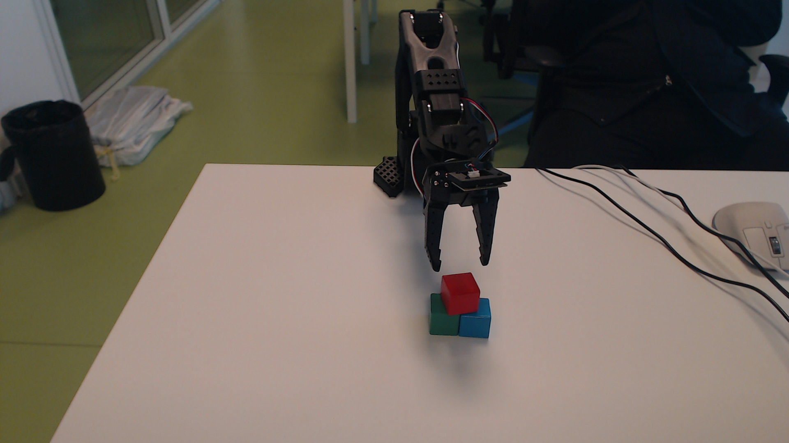
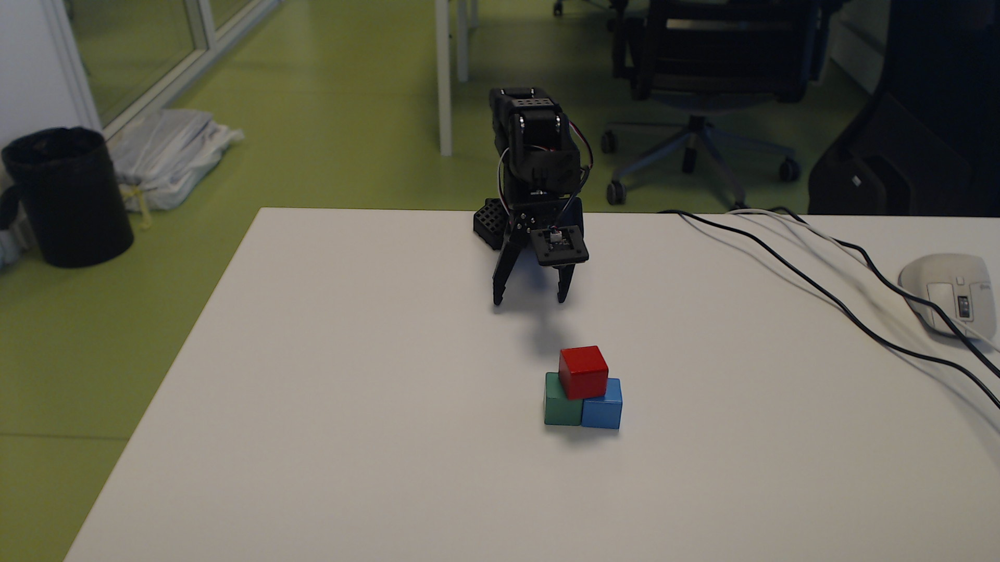

# 2026-09-21 真机红块品字型堆叠、映射修正与回位

成功：红块跨放绿、蓝两块顶部；释放后约 42 秒仍稳定，用户随后人工确认成功。回位成功：第 156 帧相对第 1 帧六电机最大偏差 6 ticks（约 0.53°），夹爪恢复初始开口。

**快照截止：actions.jsonl 第 303 行（_seq=303），frame=156，2026-09-21T21:40:32+02:00。** 后续服务记录不改变本归档。归档事件来自自定义真机控制器的 `actions.jsonl`，没有虚构 `events.jsonl`、`begin`、`complete` 或 task_id；_seq 定义为该源文件原始行号。

## 元信息

| 字段 | 记录 |
|---|---|
| 用户原话：方法 | 不需要重新采集标定，因为之前的控制方式也不是使用IK的方式，而是控制机械臂逐渐靠近目标然后进行判断抓取的。所以直接启动之前的抓取方式，相机的标定是辅助参考。 |
| 用户原话：目标 | 现在观察到正常的仿真和real robot的映射了，继续之前的任务方式。任务目标是驱动机械臂将红色方块放在另外两个方块的上方，形成品字型 |
| 用户澄清原话 | 红块叠放在绿、蓝两块上面 |
| 用户确认及回位原话 | 我已经可以人工确认放置完毕，将机械臂回到初始位置。然后将上面的过程写成log，保存起来。我已经有一份log的书写规范。 |
| 规划模型 ID | gpt-6-astra；从本地会话 turn_context 读取，见 model-source.json。由当前对话逐步决策，无另一个 API 模型 |
| Python 职责 | 相机采集、单串口持有、有界增量插值、读编码器、异常检查、原始反馈发布、MuJoCo qpos 镜像；不生成抓取决策 |
| 相机 | RGB；环境 C920 1920×1080，腕部 640×480；两路图像约每 0.5 秒保存；无深度 |
| seed/world | 真机，不适用 seed；场景静态导出模型，仅机器人反馈持续更新 |
| 运行目录 | logs/2026-09-21-real-joint-grasp；本目录是独立快照，关键证据不依赖 runs/ |
| 时区 | 表中 CEST（UTC+02:00），原始 at 保留 Unix UTC 秒 |
| 代码版本 | db54a2e9a6b1c8e310d44f36a59c1e0d8441fcb5，存在未提交修改；source/ 保存相关实际文件，未创建提交 |
| 服务参数 | 见复现方法；单串口 /dev/ttyACM0，反馈约30Hz，显示60Hz |

## 时长

| 口径 | 时长 | 边界 |
|---|---:|---|
| 对话侧：堆叠 | 1311.680 s | 21:12:00.288 用户目标 → 21:33:51.968 最后回复 |
| 服务侧 begin→complete | 无 | 控制器没有这两类事件，不能替代为动作区间 |
| 实测记录区间：堆叠 | 1240.785 s | 2026-09-21T21:12:27+02:00 → 2026-09-21T21:33:08+02:00，含观察和对话等待 |
| 实测记录区间：本次回位 | 323.836 s | 2026-09-21T21:35:08+02:00 → 2026-09-21T21:40:32+02:00 |
| 本轮对话及归档 | 未结束，不计 | 归档写入时尚无最后回复 |
| 仿真物理时间 | 不适用 | 镜像无独立物理步进；不能与上述时间换算 |

## Token

从本地 Codex token_usage_record 按 response_id 去重，逐响应 usage 按时间窗口求和；逐 turn 与 turn_token_usage 的校验见 metrics.json。input 为非缓存输入（input_tokens 减 cached_input_tokens），output 已含 reasoning_output，不能重复相加；缓存读取单列。当前回位/归档轮未计入。无图像 token 字段，不估算。窗口边界是响应落盘时间，跨边界响应不能精确拆分。

| 阶段 | 响应数 | 非缓存输入 | 缓存读取 | 缓存写入 | 输出（含推理） |
|---|---:|---:|---:|---:|---:|
| precheck | 100 | 336939 | 14591232 | 0 | 27129 |
| mapping | 25 | 220866 | 1701632 | 0 | 18152 |
| stack | 75 | 477424 | 8988160 | 0 | 23980 |

## 运行条件与证据边界

方块边长约30mm作为任务先验，不是本次视觉精密测量。环境和腕部 RGB 用于相对接近、离桌、接触、放置判断；没有深度重建或将像素转换成精确三维抓取目标。未读取物体仿真真值位姿、分割ID来指导抓取，也未移动仿真物体制造成功。日志中的 ticks 是实际编码器；degrees 是转换量；tcp_fk_auxiliary_mm 是旧约定 FK 推导，绝不是外部实测 TCP。本次没有使用 IK。

结果为模型视觉判断，并由用户人工确认。腕滚转约−90°修正只作用于 sim 映射，精确零点仍为 visual_estimate；肩偏航为 unverified_pinned；仿真夹爪开合 uncalibrated；物体位置仍停留在导出时。实时显示正常不代表全模型标定完成。相机文件时间只是新鲜度检查，非曝光时间，也未测量真实运动到画面的端到端延迟。

## 汇总

| 任务 | 已返回动作数 | 预算 | 被拒/错误记录 | 结果 | task_id |
|---|---:|---|---:|---|---|
| 连接及首次抓取暂停 | 27 | 未设总步数；每关节≤5°/步，夹爪≤100ticks/步 | 0 | 暂停，未完成抓取 | 无 |
| 朝向检查后首次回位 | 34 | 未设总步数；每关节≤5°/步，夹爪≤100ticks/步 | 0 | 完成 | 无 |
| 红块跨放绿蓝块 | 64 | 未设总步数；每关节≤5°/步，夹爪≤100ticks/步 | 0 | 完成 | 无 |
| 用户确认后回到初始位置 | 23 | 未设总步数；每关节≤5°/步，夹爪≤100ticks/步 | 0 | 完成 | 无 |

## 连接及首次抓取暂停

用户原话见元信息；首次回位对应“因为我发现仿真中的机械臂的ee角度和真实机械臂有大概90度的偏差。你先检查确认这个问题，然后将机械臂回到初始位置。”；首次接近对应“不需要重新采集标定…”的方法指令。控制器没有服务任务文本；任务语义保留于本日志。事件范围 1–56，帧 1–30；[原始事件](events-setup.jsonl)。

### 定位记录

| 事件/帧 | 相机 | 方法与假设 | 结果 | extent 自检 |
|---|---|---|---|---|
| 本阶段逐步返回帧 | 环境 RGB；抓取近处加腕部 RGB | 直接观察可见物体和夹爪相对位置，无数值3D定位 | 逐步接近/撤离，以实测反馈复查 | 未调用 propose/localize，无 extent 字段；检查方块可见轮廓与遮挡 |

### 动作与反馈

完整逐行表由 tools/build_archive.py 从归档 JSONL 对应数据生成：[动作与反馈表](ACTIONS-setup.md)。包含发令和返回两类事件，目标与实测分开，未选入关键帧的文件明确标注。

### 关键判断

观察到 sim 与 real 夹爪/相机支架方向不一致，用户暂停，停止继续接近。

### 完成证据

无服务 complete 事件。用户暂停，未宣称抓取成功。

## 朝向检查后首次回位

用户原话见元信息；首次回位对应“因为我发现仿真中的机械臂的ee角度和真实机械臂有大概90度的偏差。你先检查确认这个问题，然后将机械臂回到初始位置。”；首次接近对应“不需要重新采集标定…”的方法指令。控制器没有服务任务文本；任务语义保留于本日志。事件范围 57–125，帧 31–65；[原始事件](task-return-first.jsonl)。

### 定位记录

| 事件/帧 | 相机 | 方法与假设 | 结果 | extent 自检 |
|---|---|---|---|---|
| 本阶段逐步返回帧 | 环境 RGB；抓取近处加腕部 RGB | 直接观察可见物体和夹爪相对位置，无数值3D定位 | 逐步接近/撤离，以实测反馈复查 | 未调用 propose/localize，无 extent 字段；检查方块可见轮廓与遮挡 |

### 动作与反馈

完整逐行表由 tools/build_archive.py 从归档 JSONL 对应数据生成：[动作与反馈表](ACTIONS-return-first.md)。包含发令和返回两类事件，目标与实测分开，未选入关键帧的文件明确标注。

### 关键判断

初始第1帧编码器作为回位依据，避免使用待核实末端映射做位置控制。

### 完成证据

无服务 complete 事件。第65帧相对初始最大4ticks偏差。

## 红块跨放绿蓝块

用户原话见元信息；首次回位对应“因为我发现仿真中的机械臂的ee角度和真实机械臂有大概90度的偏差。你先检查确认这个问题，然后将机械臂回到初始位置。”；首次接近对应“不需要重新采集标定…”的方法指令。控制器没有服务任务文本；任务语义保留于本日志。事件范围 126–255，帧 66–131；[原始事件](task-stack.jsonl)。

### 定位记录

| 事件/帧 | 相机 | 方法与假设 | 结果 | extent 自检 |
|---|---|---|---|---|
| 本阶段逐步返回帧 | 环境 RGB；抓取近处加腕部 RGB | 直接观察可见物体和夹爪相对位置，无数值3D定位 | 逐步接近/撤离，以实测反馈复查 | 未调用 propose/localize，无 extent 字段；检查方块可见轮廓与遮挡 |

### 动作与反馈

完整逐行表由 tools/build_archive.py 从归档 JSONL 对应数据生成：[动作与反馈表](ACTIONS-stack.md)。包含发令和返回两类事件，目标与实测分开，未选入关键帧的文件明确标注。

### 关键判断

首次闭爪推转红块后重新张开；试提未见离桌后降低并重新夹持；第105帧确认提起；转移时逐步收回；第126帧下降后姿态变平正，127–128帧松爪，129–131帧抬离和静置检查。

### 完成证据

无服务 complete 事件。第131帧放置稳定，用户人工确认成功；最终照片见下方。

## 用户确认后回到初始位置

用户原话见元信息；首次回位对应“因为我发现仿真中的机械臂的ee角度和真实机械臂有大概90度的偏差。你先检查确认这个问题，然后将机械臂回到初始位置。”；首次接近对应“不需要重新采集标定…”的方法指令。控制器没有服务任务文本；任务语义保留于本日志。事件范围 256–303，帧 132–156；[原始事件](task-return.jsonl)。

### 定位记录

| 事件/帧 | 相机 | 方法与假设 | 结果 | extent 自检 |
|---|---|---|---|---|
| 本阶段逐步返回帧 | 环境 RGB；抓取近处加腕部 RGB | 直接观察可见物体和夹爪相对位置，无数值3D定位 | 逐步接近/撤离，以实测反馈复查 | 未调用 propose/localize，无 extent 字段；检查方块可见轮廓与遮挡 |

### 动作与反馈

完整逐行表由 tools/build_archive.py 从归档 JSONL 对应数据生成：[动作与反馈表](ACTIONS-return.md)。包含发令和返回两类事件，目标与实测分开，未选入关键帧的文件明确标注。

### 关键判断

第132帧确认堆叠稳定，逐步收回肩肘腕；第153帧具名目标回到原始ticks，随后恢复夹爪开口；第156帧静置复核。

### 完成证据

无服务 complete 事件。第156帧实测保持，六电机误差见下表。

| 电机ID | 初始ticks | 最终ticks | 差值 |
|---|---:|---:|---:|
| 1 | 2019 | 2013 | -6 |
| 2 | 973 | 979 | +6 |
| 3 | 2961 | 2958 | -3 |
| 4 | 2701 | 2698 | -3 |
| 5 | 2149 | 2151 | +2 |
| 6 | 2497 | 2494 | -3 |





## 失败分析

| 现象 | 数据 | 假设 | 如何验证 | 结论 | 教训 |
|---|---|---|---|---|---|
| 末端方向约90°差异 | motor5=2151；旧映射+9.10°；手眼拟合将腕滚转固定零 | 固定参数被误当作实物零点 | 查标定来源、同反馈±90°离线渲染、多姿态实拍对照 | 零点来源问题已确认；−90°是视觉估计，精度未验证 | 拟合成功不等于所有关节零点已标定 |
| 首次闭爪推转红块 | 第95帧及前后图像 | 夹持位置偏，未形成两侧接触 | 张开、微调接近、再次闭爪 | 推转和后续成功可见；接触力分布未测量 | 每次夹紧后先小幅试提 |
| 第102帧试提不明确 | 新图像未明确离桌 | 抓取偏浅或打滑 | 降低、略收紧后再次短提，105帧离桌 | 重新抓取后提起已验证；具体摩擦原因未验证 | 不把闭爪目标当抓取成功 |
| 肩肘反馈未完全到目标 | 逐步返回ticks与目标不同 | 重力、摩擦或死区影响 | 比较当前目标与实测，再按实际位置规划 | 差值已测得，物理成因未独立验证 | 不盲目反放动作或累加未实现位移 |

## 事后更正

最初“品字型”曾被理解为桌面三角排布，用户明确更正为叠放，本次按叠放执行。旧控制日志的 wrist_roll=+9.10°沿用加载时的旧映射，显示修正后约−80.90°，两者不能混用。旧FK亦保留原值，不改写原始记录。STACK_RED 初版只记录堆叠结束时抬离未回位；本归档追加后来按用户要求的回位结果，不把两个时刻混为一谈。

## 关键帧索引

- [0001-env.png](frames/0001-env.png)：初始实测姿态。
- [0030-env.png](frames/0030-env.png)：朝向问题暂停。
- [0065-env.png](frames/0065-env.png)：首次回位。
- [0095-env.png](frames/0095-env.png)：首次闭爪推动红块。
- [0102-env.png](frames/0102-env.png)：试提未确认离桌。
- [0105-env.png](frames/0105-env.png)：重新夹持后提起。
- [0126-env.png](frames/0126-env.png)：下降就位。
- [0131-env.png](frames/0131-env.png)：松爪抬离后稳定。
- [0156-env.png](frames/0156-env.png)：最终回位后堆叠仍稳定。

另有 0105-wrist.png（夹持提起）和0131-wrist.png（松爪后稳定）。原图原名保留；为保留失败证据和原始PNG，本归档超过规范建议的3MB目标，未复制连续反馈巨量日志或全帧目录。

## 代码改动与测试

本轮回位和归档没有修改控制器、映射或抓取算法，仅新增归档脚本与文档。先前映射修正涉及 realsim/arm_mapping.py、arm_sync.py、对应tests、scene.json及REALSIM_README.md；source/保存相关运行文件。先前验证记录：MuJoCo环境182 passed/6 skipped，相机环境116 passed/5 skipped；最初在MuJoCo环境合并运行相机测试因缺cv2收集失败，拆分到已有相机环境后通过。详细旧验证见 ANALYSIS-mapping-original.md（原文快照中的相对链接属于原目录，不作为本归档必要证据）。本轮只核对日志完整性和回位反馈，不把旧测试称为本轮重跑。

## 复现方法

这是实际执行归档，不是无人监督自动重放动作的脚本。真实初始状态必须重新观察；当前桌上已堆好，不能把历史动作再次直接发送。自定义控制器启动时以排他模式创建actions.jsonl，已有本次日志时再次启动会拒绝覆盖；当前服务保留，不重复占用串口。

当次实际启动命令（仓库根目录；控制和相机命令在 LLM-control 下）：

```bash
cd LLM-control
.venv-rgbcal/bin/python -u calib/c920-real-grasp-01/tools/dual_view.py --out logs/2026-09-21-real-joint-grasp/live
SO101_FEEDBACK_PATH=/tmp/so101-arm.json SO101_FEEDBACK_HZ=30 SO101_FEEDBACK_LOG=logs/2026-09-21-real-joint-grasp/raw-feedback.jsonl PYTHONPATH=. .venv-rgbcal/bin/python -u logs/2026-09-21-real-joint-grasp/tools/joint_control.py
```

同步与静态场景入口（仓库根目录）：

```bash
bash LLM-control/run_realsim.sh export --scene LLM-control/calib/realsim-model/scene.json --output LLM-control/calib/realsim-model/scene.xml
DISPLAY=:0 MUJOCO_GL=glfw bash LLM-control/run_realsim.sh sync --scene LLM-control/calib/realsim-model/scene.json --xml LLM-control/calib/realsim-model/scene.xml --state /tmp/so101-arm.json --display-rate 60 --viewer --record LLM-control/logs/2026-09-21-real-joint-grasp/ee-mapping-fix/live-converted.jsonl --status-output /tmp/so101-mirror-status.json
```

用具名关节映射读取JSONL动作和实测ticks可复核本记录，不能用目标代替反馈。source中的XML依赖仓库机器人资产，不是脱离项目可独立运行的安装包；本归档的事件、关键帧、统计及判断证据自包含。tools/build_archive.py从原始日志生成本快照，不发送任何动作。
