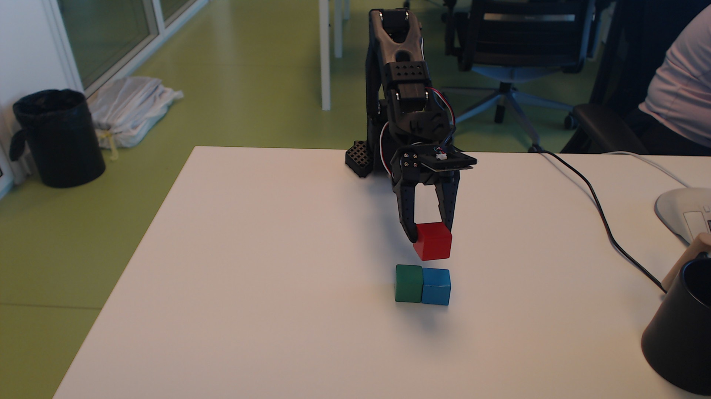
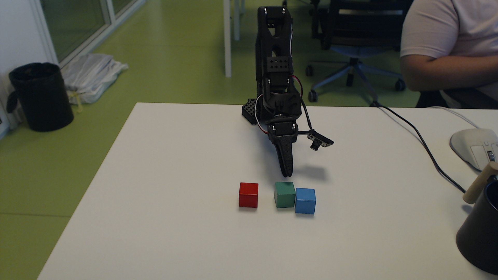

# 2026-09-22 仅真机：抬红块、堆叠终止与回位

抬红块：视觉确认成功，24次运动动作。红块放桌：释放并撤离后确认。绿块叠红块：用户终止，未完成；本阶段28次运动动作，绿块未抓起。

堆叠快照截止：源 actions.jsonl 第110行（_seq=110）、frame=58。回位为后续独立阶段，执行后追加 RETURN.md。最新机器可读截止见 [summary.json](summary.json)。没有虚构begin/complete、task_id或自动评分。

## 元信息

| 字段 | 记录 |
|---|---|
| 用户原话：抬起 | 抬起红色方块 |
| 用户原话：堆叠 | 将红色方块放在桌子上，然后将绿色方块放在红色方块上方 |
| 用户原话：终止 | 终止当前的任务，将这个任务过程写成logs，然后同步更新的github相应的branch，不要新开branch。最后将机械臂复位到初始状态。 |
| 原始换行与时间 | [task-instructions.json](task-instructions.json) |
| 规划模型 | gpt-6-astra；来自本地turn_context，见 [model-source.json](model-source.json) |
| Python职责 | RGB采集、单串口持有、增量插值、编码器读取、报警与跟随误差检查；规划由当前VS Code对话完成 |
| 控制 | 具名joints delta_deg，每关节每步≤10°；夹爪每步≤100ticks；无IK/OSC |
| 相机 | 环境C920 RGB 1920×1080；腕部RGB 640×480；无深度 |
| world/seed | 真机，不适用；未启动MuJoCo镜像 |
| 运行目录 | LLM-control/runs/real-only-20260922-204451 |
| 时间 | CEST / UTC+02:00；源at为Unix秒 |
| 代码起点 | d9749fe90271bb5bd6a0d84346788b0fd139c342，加±10°上限修改；实际源码见source/joint_control.py |
| 分支 | realsim-sync-and-real-stack-20260921，沿用原分支 |

## 时长

| 口径 | 抬红块 | 放桌及堆叠尝试 |
|---|---:|---:|
| 实测记录首末帧间隔 | 494.253s（帧4–28） | 2065.353s（帧29–58） |
| 对话用户消息→最后回复 | 未单独统计 | 用户中断，无正常完成回复 |
| 服务begin→complete | 无此事件 | 无此事件 |
| 仿真物理时间 | 不适用 | 不适用 |

记录间隔包括观察、决策和等待，不是电机运动耗时。回位/归档轮未结束，不估算时长。

## Token

从抬红块指令至终止指令前，按response_id去重；input为非缓存输入，output已含推理。见 [metrics.json](metrics.json)、[usage-source.jsonl](usage-source.jsonl)。两轮逐响应和均与最后turn_token_usage相符。当前归档/回位轮未计入，无图像token字段，不推算。

| 非缓存输入 | 缓存读取 | 缓存写入 | 输出（含推理） |
|---:|---:|---:|---:|
| 210442 | 14926208 | 0 | 15443 |

## 运行条件与证据边界

方块约30mm为先验，不是本次测量。两路RGB用于判断相对位置，没有深度或像素重投影；未调用localize/propose，没有extent字段。没有读取物体仿真真值或分割ID。ticks为编码器实测，degrees为换算，tcp_fk_auxiliary_mm为辅助FK，不能当作外部实测TCP。成败为对话模型视觉判断，无自动评分。图像文件新鲜度不等于曝光时间或端到端延迟。

## 汇总

| 阶段 | 返回动作数 | 限幅 | 错误/拒绝 | 结果 | task_id |
|---|---:|---|---:|---|---|
| 连接及保持 | 1 | 保持当前位置 | 0 | 已连接 | 无 |
| 抬红块 | 24 | 10° / 100ticks | 0 | 提起并保持 | 无 |
| 放桌及绿块堆叠 | 28 | 10° / 100ticks | 0 | 红块放桌，堆叠终止 | 无 |

## 抬起红色方块

用户原话见上，无服务任务文本。事件4–52、帧4–28：[task-lift-red.jsonl](task-lift-red.jsonl)。连接事件1–3见 [events-setup.jsonl](events-setup.jsonl)。

### 定位记录

| 帧 | 相机/方法 | 结果 | extent |
|---|---|---|---|
| 4–28 | 两路RGB视觉接近与试抬 | 以新图及反馈调整，不将闭爪等同成功 | 无；检查可见轮廓、遮挡 |

### 动作与反馈

脚本生成 [ACTIONS-lift-red.md](ACTIONS-lift-red.md)，连接见 [ACTIONS-setup.md](ACTIONS-setup.md)。

### 关键判断

闭合后小幅试抬；未明确离开支撑时再收紧。第27–28帧红块悬空并保持，才确认提起。

### 完成证据

无complete事件；[lift-red-result.json](lift-red-result.json)为本地结果记录。第27、28帧为视觉证据。



## 红块放桌、绿块叠红块（终止）

用户原话见上；事件53–110、帧29–58：[task-stack-cancelled.jsonl](task-stack-cancelled.jsonl)。第57帧动作后用户中断，第58帧仅观察，未再继续抓取。

### 定位记录

| 帧 | 相机/方法 | 结果 | extent |
|---|---|---|---|
| 29–39 | 两路RGB逐步降低、松爪 | 红块单独放桌，抬离后稳定 | 无；检查桌面接触和释放 |
| 40–50 | RGB观察绿蓝相邻，转腕靠近 | 改为前后夹持，尚未抓起 | 无；遮挡增加 |
| 51–58 | 新RGB重新定位 | 夹指带动绿块，抬高重调，用户终止 | 无；更新物体位置 |

### 动作与反馈

脚本生成完整 [ACTIONS-stack-cancelled.md](ACTIONS-stack-cancelled.md)，不删除失误步骤。

### 关键判断

红块放到绿蓝左侧空桌面，松爪后抬离确认。绿蓝紧挨，改为前后夹取；接近过程中带动绿块，随后抬高重调。终止时未闭爪抓绿块。

### 完成证据

无complete，结果为用户取消。第39帧确认红块放桌；第58帧记录终止现场。



## 失败分析

| 现象 | 数据 | 假设 | 验证 | 结论与教训 |
|---|---|---|---|---|
| 绿块移位 | 第50→51帧相对蓝块位置改变 | 夹指接触、接近位置偏 | 对比RGB | 位移可见；力未测量。调整后重定位 |
| 接近多次重调 | 第40–57帧 | 转腕后透视及图像方向影响对齐 | 比较图像与反馈，未外测 | 具体误差来源未验证，FK不能替代观察 |
| 负向肩关节未到目标 | before/target与返回ticks不同 | 重力、摩擦或死区 | 比较反馈差值 | 差值已测，成因未验证，不累加未实现位移 |
| 堆叠未完成 | 用户终止、第58帧方块都在桌上 | 不适用 | 新RGB确认 | 记cancelled，不记success |

## 事后更正

“准备抓取”“正在对齐”仅为过程状态。绿块未确认提起或叠放。接近方向曾需要重新调整，以实际图像和编码器为准；未改写原始事件。

## 关键帧索引

0001初始；0027/0028抬红块；0037松爪；0039红块放稳；0050/0051绿块位移前后；0058终止现场。保留原PNG，为保留失败证据超过3MB建议目标。其余全帧留本地runs，不作为归档必要证据。

## 代码改动与测试

bounded_goal从±5°改为±10°；速度、关节限位和夹爪限幅不变。tools/check_joint_limit.py离线验证7个有效幅度、5个无效输入和越界目标拒绝，已通过，不打开串口。归档工具从JSONL生成表格、统计，并校验序号和SHA256；未运行无关全套仿真测试。

## 复现方法

本归档供复核，不能直接重放运动。新会话需要新建运行目录，控制器复制到tools下，防止覆盖日志。相机与控制器工作目录为LLM-control。当次启动：

```bash
PYTHONPATH=. .venv-rgbcal/bin/python -u calib/c920-real-grasp-01/tools/dual_view.py --out runs/real-only-20260922-204451/live
env -u SO101_FEEDBACK_PATH -u SO101_FEEDBACK_LOG -u SO101_FEEDBACK_HZ PYTHONPATH=. .venv-rgbcal/bin/python -u runs/real-only-20260922-204451/tools/joint_control.py
```

控制器独占串口；VS Code当前会话通过持久终端stdin发送带最新frame的JSON。observe不运动，joints为关节增量，gripper为夹爪ticks。每次动作返回新图与编码器，当前对话生成下一步；单独运行Python不产生自然语言决策。归档脚本只离线读文件，不发送运动。
